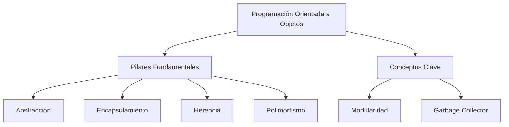
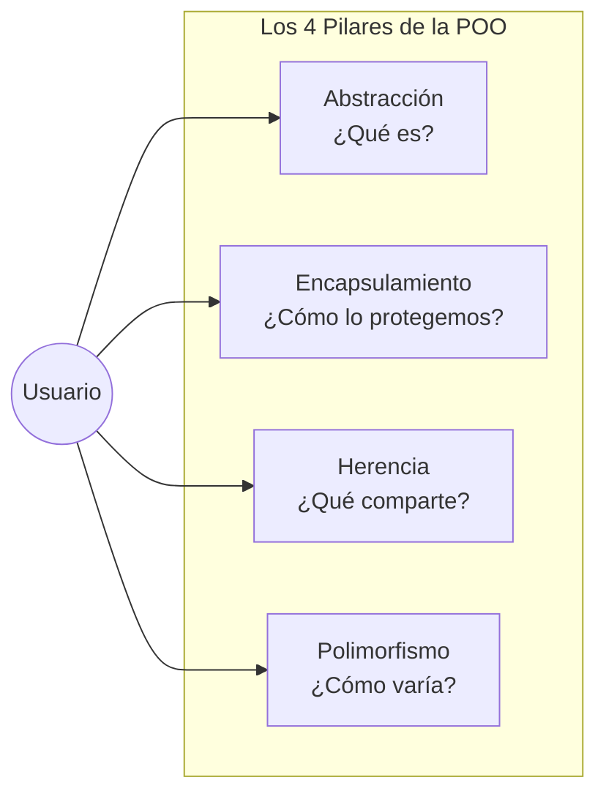
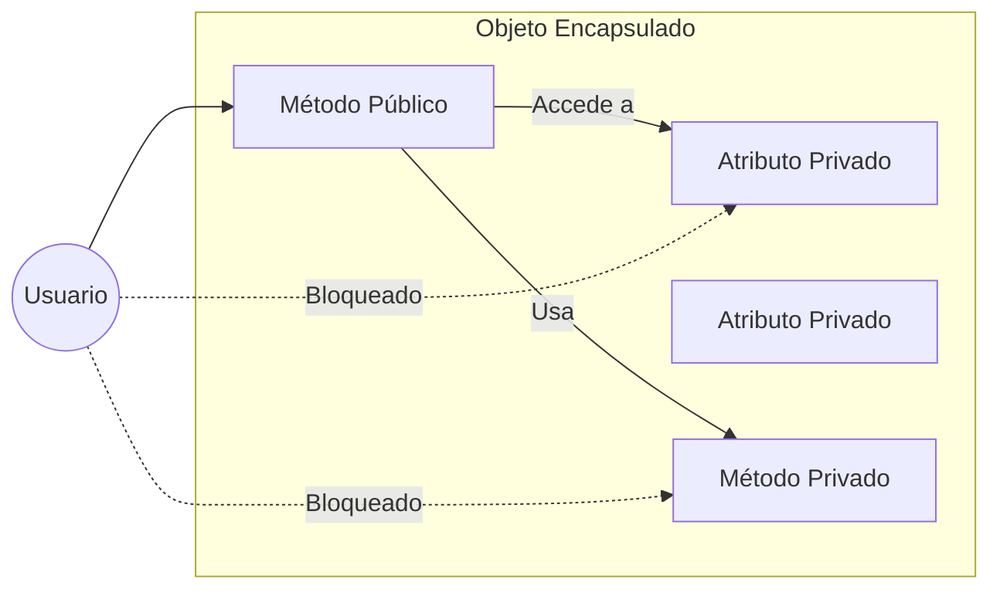

- [1. Programación orientada a objetos: conceptos y principios](#1-programación-orientada-a-objetos-conceptos-y-principios)
  - [1.1 ¿Qué es la programación orientada a objetos?](#11-qué-es-la-programación-orientada-a-objetos)
  - [1.2 Abstracción](#12-abstracción)
  - [1.3 Ocultación](#13-ocultación)
  - [1.4 Encapsulamiento](#14-encapsulamiento)
  - [1.5 Herencia](#15-herencia)
  - [1.6 Polimorfismo](#16-polimorfismo)
  - [1.7 Modularidad](#17-modularidad)
  - [1.8 Recolector de basura (Garbage Collector)](#18-recolector-de-basura-garbage-collector)
  - [1.9 Resumen: importancia de los conceptos en el diseño de software](#19-resumen-importancia-de-los-conceptos-en-el-diseño-de-software)
  - [1.10 Matiz del Profesor: ¿Encapsulamiento u Ocultación?](#110-matiz-del-profesor-encapsulamiento-u-ocultación)


# 1. Programación orientada a objetos: conceptos y principios

La **programación orientada a objetos (POO)** es una forma de pensar y escribir nuestros programas inspirada en cómo observamos y comprendemos el mundo real. En la vida cotidiana, vemos que todo está formado por “cosas” (objetos) con características y comportamientos propios: una bicicleta, una persona, un control remoto, un libro...
La POO traslada este modo de pensar al software, ayudándonos a construir programas claros, flexibles y fáciles de ampliar.

## 1.1 ¿Qué es la programación orientada a objetos?

La POO gira en torno al **objeto**. Un objeto es como una “caja” que puede guardar información relevante y ofrece acciones que se pueden realizar sobre él. Lo importante de los objetos es:

- **Estado:** Son los datos que almacena el objeto: por ejemplo, el color de una bicicleta, la edad de una persona.
- **Comportamiento:** Son las operaciones que el objeto puede ejecutar: la bicicleta puede frenar o pedalear, una persona puede caminar o hablar.
- **Identidad:** Cada objeto es único, aunque dos tengan el mismo estado y comportamiento. Por ejemplo, dos hojas de papel iguales: cada una sigue siendo una hoja distinta.

**Ejemplo cotidiano:**
Imagina un “ordenador” como objeto:
- Estado: sistema operativo, cantidad de memoria RAM, número de serie
- Comportamiento: encenderse, apagar, instalar software
- Identidad: cada ordenador tiene un número de serie propio; aunque dos sean iguales en marca, modelo y memoria, siguen siendo computadoras diferentes.

La POO nos ayuda a organizar nuestros programas como si estuviéramos “construyendo con piezas de Lego”, cada una con su forma, función y nombre propio.



## 1.2 Abstracción

La **abstracción** consiste en fijarnos solo en las características importantes de un objeto, dejando de lado detalles irrelevantes.     
Al diseñar un programa para una biblioteca, por ejemplo, te interesarán el título, el autor y el número de páginas de un libro, pero probablemente no importe el tipo de papel o el color de la portada.

**Ejemplo:**
Piensa en una cafetera. Si vas a modelarla para un programa que gestiona pedidos, sólo necesitas saber si está encendida, cuánta agua tiene y cuánto café queda, no te importa el tornillo que sujeta el filtro.

## 1.3 Ocultación

La **ocultación** significa que cada objeto guarda sus secretos: no puedes ver ni modificar directamente sus datos internos, sólo acceder a lo que te deja su “interfaz” pública.
Igual que con un mando de televisión: sabes que apretando el botón de encendido, la tele se enciende, pero no sabes cómo funciona por dentro.

**Ejemplo:**
Una caja fuerte solo te deja sacar dinero si conoces la combinación; nadie puede coger dinero rompiendo la caja sin saber su mecanismo.  

## 1.4 Encapsulamiento

El **encapsulamiento** junta el estado y los comportamientos de un objeto en un único “contenedor”, ocultando detalles internos y controlando los cambios. De ese modo, si un objeto cambia algo dentro de sí mismo, el resto del programa no se estropea ni se ve afectado.      

**Ejemplo:**
Un automóvil decide por sí solo, según su motor y sensores, cuándo encender el ventilador de refrigeración; tú solamente puedes conducir y revisar el panel, pero no gestionas directamente sus variables internas.

## 1.5 Herencia

La **herencia** permite crear objetos que “heredan” características y comportamientos de otros más generales. Es como decir “todos los perros son animales”, así que tienen patas, respiran, pero además los perros pueden ladrar.

**Ejemplo:**
Un “cuaderno” hereda de “libro”, pues ambos tienen páginas, autor y título, pero el cuaderno, además, tiene hojas en blanco y quizá una espiral.

## 1.6 Polimorfismo

El **polimorfismo** da flexibilidad: diferentes objetos pueden responder a la misma orden de maneras distintas.  
Si le pides a tu teléfono y al televisor “encender”, ambos “entienden” la petición, pero cada uno lo hace en su propio estilo.

**Ejemplo:**
Si lanzas una pelota al perro y al robot aspirador, ambos “se mueven” hacia ella, pero el perro corre, el robot gira y avanza; la orden “muévete” se interpreta diferente según el objeto.

## 1.7 Modularidad
La **modularidad** es la práctica de dividir un programa en partes independientes y reutilizables llamadas módulos. Cada módulo encapsula una funcionalidad específica y puede interactuar con otros módulos a través de interfaces bien definidas. Es por ello que los objetos, al ser módulos en sí mismos, facilitan la creación de sistemas modulares.

## 1.8 Recolector de basura (Garbage Collector)
El **recolector de basura** es un sistema automático que gestiona la memoria en lenguajes como C#, Java o Kotlin. Su función es liberar la memoria ocupada por objetos que ya no se usan (no referenciados), evitando fugas de memoria y optimizando el rendimiento del programa. 

## 1.9 Resumen: importancia de los conceptos en el diseño de software

La POO ayuda a construir programas muy grandes y complejos al dividir todo en “piezas” bien definidas, cada una responsable de lo suyo.  
Los objetos permiten modelar la realidad, proteger los datos importantes, crear partes reutilizables y asegurar que los cambios no rompan el resto del sistema.
Al usar abstracción, ocultación, encapsulamiento, herencia y polimorfismo, podemos crear software que es mucho más fácil de entender, mantener y ampliar.

## 1.10 Matiz del Profesor: ¿Encapsulamiento u Ocultación?

Es muy común que el alumnado confunda estos dos términos. Aquí tienes la distinción definitiva:

*   **Encapsulamiento**: Es el acto de **agrupar** datos (estado) y métodos (comportamiento) que operan sobre esos datos en una misma unidad (la clase). Es como poner medicina dentro de una cápsula.
*   **Ocultación**: Es el acto de **limpiar el acceso** a esos datos. Es decidir qué partes de la "cápsula" son transparentes y cuáles opacas mediante modificadores como `private` o `public`.

> **Regla mnemotécnica**: El encapsulamiento **reúne**, la ocultación **protege**.

> 📝 **Nota del Profesor:** Los cuatro pilares de la POO (Abstracción, Encapsulamiento, Herencia, Polimorfismo) se memorizan con las iniciales **AEHP** o "A-E-H-P". En el examen, si te piden explicar qué es la POO, menciona estos cuatro pilares con un ejemplo de cada uno.



```csharp
// Ejemplo práctico: Un coche como objeto POO
public class Coche
{
    // ESTADO (atributos privados - ocultación)
    private string _marca;
    private int _velocidad;
    
    // PROPIEDAD PÚBLICA (interfaz controlada)
    public string Marca 
    { 
        get => _marca; 
        set => _marca = value ?? "Sin marca";
    }
    
    // COMPORTAMIENTO (métodos)
    public void Acelerar(int incremento)
    {
        _velocidad += incremento;
    }
    
    public void Frenar(int decremento)
    {
        _velocidad = Math.Max(0, _velocidad - decremento);
    }
}

// HERENCIA: Un CocheDeportivo ES UN Coche
public class CocheDeportivo : Coche
{
    public bool TurboActivado { get; private set; }
    
    public void ActivarTurbo()
    {
        TurboActivado = true;
        Acelerar(50);  // Comportamiento específico
    }
}

// POLIMORFISMO: Diferentes objetos responden igual
Coche miCoche = new Coche();
CocheDeportivo miDeportivo = new CocheDeportivo();

miCoche.Acelerar(20);       // Velocidad +20
miDeportivo.Acelerar(20);   // Velocidad +20 (igual mensaje, diferente resultado si hay turbo)
```

> 💡 **Tip de examen:** En el examen práctico, si te piden crear una clase, aplica los 4 pilares:
> 1. **Abstracción**: Identifica qué atributos y métodos son esenciales
> 2. **Encapsulamiento**: Haz privados los campos, usa propiedades públicas
> 3. **Herencia**: Si hay relación "ES-UN", crea clase base
> 4. **Polimorfismo**: Usa `virtual`/`override` para comportamientos variables


