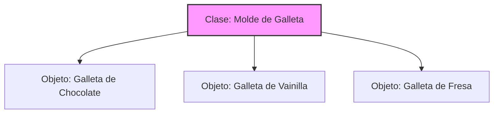
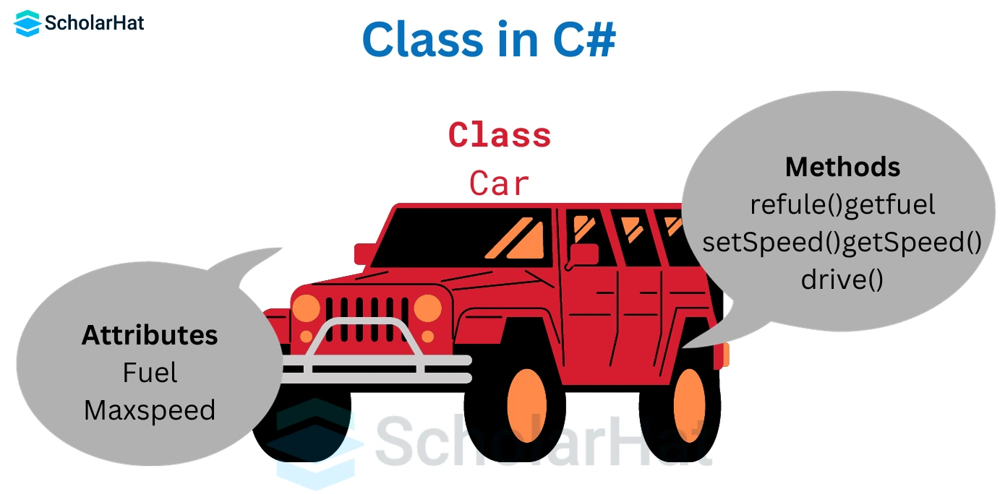
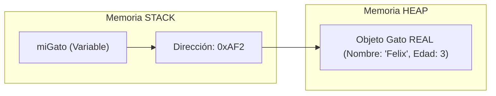
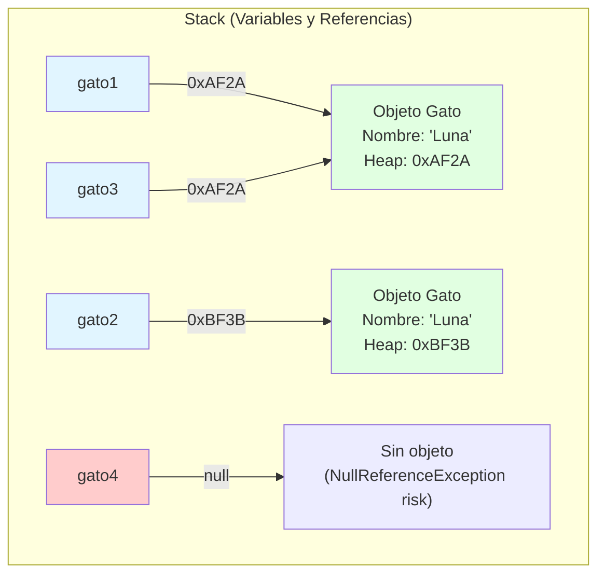

- [2. Objetos y Clases](#2-objetos-y-clases)
  - [2.1 Explicación detallada: identidad, estado y comportamiento](#21-explicación-detallada-identidad-estado-y-comportamiento)
    - [Identidad](#identidad)
    - [Estado](#estado)
    - [Comportamiento](#comportamiento)
    - [Interfaz pública](#interfaz-pública)
  - [2.2 Diferencia entre objetos y tipos simples](#22-diferencia-entre-objetos-y-tipos-simples)
  - [2.3 La clase: el mecanismo para crear y tipificar objetos](#23-la-clase-el-mecanismo-para-crear-y-tipificar-objetos)
  - [2.4 ¿Cómo se crea un objeto en C#? ¿Qué pasa con la referencia?](#24-cómo-se-crea-un-objeto-en-c-qué-pasa-con-la-referencia)
  - [2.5 Resumen para el alumno](#25-resumen-para-el-alumno)
  - [2.6 El Modelo de Memoria: Stack vs. Heap](#26-el-modelo-de-memoria-stack-vs-heap)


# 2. Objetos y Clases

Un **objeto** en programación es una representación digital de algo del mundo real o de una idea. Es como un “actor” dentro de tu programa, con personalidad (identidad), datos (estado) y capacidades (comportamiento).


## 2.1 Explicación detallada: identidad, estado y comportamiento

### Identidad

La identidad es lo que hace único a cada objeto, aunque tenga la misma información que otro.
En la vida real, dos carnets de identidad pueden mostrar la misma foto y datos personales, pero cada uno es una tarjeta física distinta, con su propio número y dueño.
En programación, la identidad de un objeto se corresponde con la referencia que el ordenador guarda en memoria: cada vez que usas `new` en C#, creas un objeto con una identidad propia, aunque le des los mismos datos que a otro.

**Ejemplo práctico:**
Imagina dos “bolígrafos” de color azul. Aunque ambos sean iguales y nuevos, uno está en Madrid y otro en Valencia: cada uno es una unidad diferente. En programación, aunque dos objetos tengan el mismo estado, su identidad siempre es distinta porque ocupan diferentes lugares de memoria.

### Estado

El estado de un objeto es la colección de datos que define cómo es ese objeto en un momento dado.
Por ejemplo:
- Un alumno: estado = nombre, edad, nota media, curso
- Un semáforo: estado = color actual, si está funcionando o no

El estado puede cambiar a lo largo del tiempo si el objeto tiene comportamientos que lo permiten.

### Comportamiento

El comportamiento es el conjunto de acciones que el objeto puede ejecutar o las respuestas que puede dar. Estas acciones pueden modificar su estado o interactuar con otros objetos.

Por ejemplo:
- Una puerta: puede abrirse, cerrarse, bloquearse
- Un reloj: puede mostrar la hora, poner la alarma, vibrar

El comportamiento se define en programación como los “métodos” o “funciones” del objeto.

### Interfaz pública
La interfaz pública de un objeto es el conjunto de métodos y propiedades que otros objetos o partes del programa pueden usar para interactuar con él.

---

## 2.2 Diferencia entre objetos y tipos simples

Antes de crear tus propios objetos, observa que tipos como números (`int`, `double`) y letras (`char`, `string`), ya existen desde siempre en los lenguajes de programación.

Por ejemplo:
- Un número como 42 es simplemente un valor; no necesitas rastrear su identidad, sólo su estado.
- Una cadena como “Hola” es un pedazo de texto; puedes consultar su longitud, unirla con otras, pero no tiene una “personalidad”.        

El objeto va más allá de esto: puedes definir cómo es, qué puede hacer y cómo debe comportarse en situaciones diferentes.

**Ejemplo:**
Si tienes varios libros, cada uno tendrá un título, un autor y un número de páginas.
Pero si programas una biblioteca, querrás representar cada libro como objeto para gestionarlo, buscarlo o prestarlo.

---

## 2.3 La clase: el mecanismo para crear y tipificar objetos

En C# (y en muchos lenguajes modernos), **la clase** es la herramienta que te permite definir cómo deben ser tus objetos: qué información guardan y qué acciones pueden realizar.
La clase es como el molde de una galleta: define el borde, el tamaño y la forma; luego puedes “fabricar” galletas diferentes, pero todas se basan en ese molde.
A cada objeto creado desde la clase se le llama **instancia**, y a todas juntas, objetos de ese tipo.






**Por qué tipificar objetos:**
Tipificar significa que cada objeto tiene su propio “tipo” y el compilador puede ayudarte a verificar que uses cada uno correctamente; así evitas confusiones y errores (por ejemplo, no intentas sumar una puerta a una bicicleta).

---

## 2.4 ¿Cómo se crea un objeto en C#? ¿Qué pasa con la referencia?

Cuando quieres utilizar un objeto en C#, lo creas a partir de una clase usando la palabra clave `new`.
Esto hace tres cosas importantes:

1. **Reserva memoria** para almacenar la información del objeto.
2. **Inicializa el estado inicial** del objeto, según lo que hayas definido en la clase.
3. **Devuelve una referencia**, es decir, una “dirección” en la memoria del programa por donde podrás localizar ese objeto para usarlo en el futuro.

Así, aunque crees dos objetos iguales (mismo estado), cada uno tendrá una referencia diferente y serán instancias distintas (con identidad propia).

**Ejemplo:**
- Primero imaginas cómo debe ser tu “coche” (la clase).
- Luego, cada vez que usas `new`, fabricas un coche concreto (el objeto).
- El ordenador te da una “tarjeta” con la dirección de ese objeto.
- Si cambias la matrícula de un coche, sólo se actualiza ese coche: los demás permanecen igual.

---

## 2.5 Resumen para el alumno

- Un **objeto** es cualquier cosa de tu programa con identidad, estado y comportamiento.
- La **clase** es la receta que usas para crear objetos. Es como el plano de una casa; puedes hacer muchas casas parecidas, pero cada una será única.
- Al **crear** un objeto con `new`, le das vida propia: obtiene una identidad, guarda datos (estado) y puede hacer cosas (comportamiento). La **referencia** te permite acceder a él siempre que lo necesites.

> Entender bien estos conceptos es el primer paso fundamental para dominar la programación orientada a objetos y convertirte en un programador capaz de diseñar software potente y fiable.

---

## 2.6 El Modelo de Memoria: Stack vs. Heap

Para un desarrollador, es vital entender qué pasa dentro del ordenador cuando escribimos `Gato miGato = new Gato();`.

1.  **Stack (Pila)**: Es una memoria muy rápida pero pequeña. Aquí se guarda el nombre de la variable (`miGato`) y la **referencia** (la dirección de memoria).
2.  **Heap (Montículo)**: Es una memoria más grande donde viven los **objetos reales**. Aquí es donde el operador `new` reserva el espacio para los datos del gato.



> **Nota importante**: Si la variable en el Stack no tiene ninguna dirección (apunta a nada), su valor es **`null`**. Si intentas usarla así, el programa "explota" porque no sabe a qué dirección del Heap ir a buscar los datos. Esto es lo que aprenderemos a gestionar como la seguridad ante nulos.

> 📝 **Truco del Examinador:** En el examen, cuando veas `new Clase()`, piensa: "Se crea un objeto en el Heap y se devuelve su referencia". Cuando veas `Clase objeto;` sin `new`, piensa: "Solo se crea una variable en el Stack que apunta a `null`".

```csharp
// DEMOSTRACIÓN DE IDENTIDAD Y REFERENCIA
public class Gato
{
    public string Nombre { get; set; }
    public Gato(string nombre) => Nombre = nombre;
}

// Creamos dos objetos con el MISMO estado
var gato1 = new Gato("Luna");
var gato2 = new Gato("Luna");

Console.WriteLine(gato1 == gato2);        // false (diferentes referencias)
Console.WriteLine(gato1.Equals(gato2));   // false (diferentes objetos)
Console.WriteLine(gato1.GetHashCode());   // Diferente código hash
Console.WriteLine(gato2.GetHashCode());   // Diferente código hash

// Ahora gato3 referencia al MISMO objeto que gato1
var gato3 = gato1;
Console.WriteLine(gato1 == gato3);        // true (misma referencia)
Console.WriteLine(gato1.GetHashCode());   // Igual que gato3
```



> 💡 **Analogía del buzón:** Imagina que un objeto es una casa y la referencia es la dirección. Cuando escribes `Gato gato1 = new Gato()`, estás:
> 1. Construyendo la casa (el objeto en el Heap)
> 2. Obteniendo la dirección (la referencia `0xAF2A`)
> 3. Guardando esa dirección en tu agenda (la variable `gato1` en el Stack)
