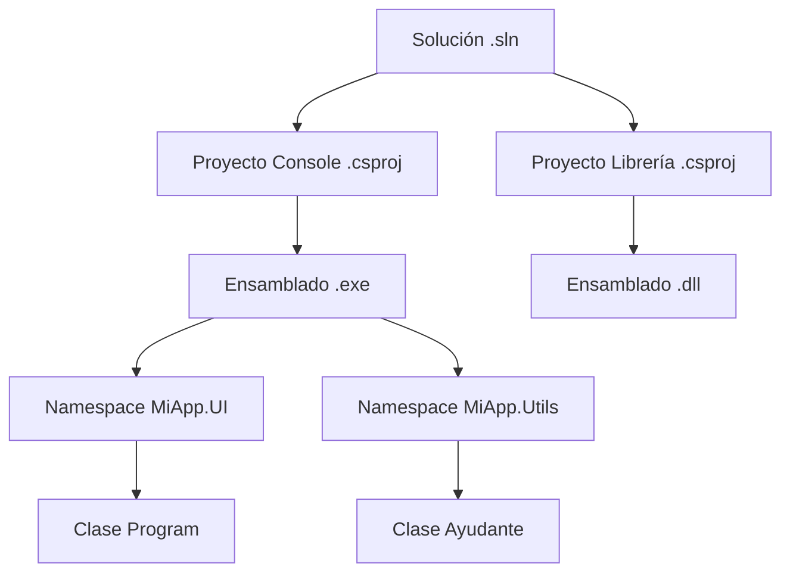

- [3. Espacios de nombres y Organización del Proyecto](#3-espacios-de-nombres-y-organización-del-proyecto)
  - [3.1 Namespace y file-scoped namespace](#31-namespace-y-file-scoped-namespace)
    - [3.1.1 File-scoped namespace (C# 10+)](#311-file-scoped-namespace-c-10)
  - [3.2 Using y alias](#32-using-y-alias)
  - [3.3 Soluciones, Proyectos y Ensamblados](#33-soluciones-proyectos-y-ensamblados)
    - [3.3.1 Solución (.sln)](#331-solución-sln)
    - [3.3.2 Proyecto (.csproj)](#332-proyecto-csproj)
    - [3.3.3 Ensamblado](#333-ensamblado)
    - [3.3.4 Namespace (Repaso Organizativo)](#334-namespace-repaso-organizativo)
  - [3.4 Relación práctica](#34-relación-práctica)
  - [3.5 Visualización de la Estructura de Trabajo en C#](#35-visualización-de-la-estructura-de-trabajo-en-c)
  - [3.6 Buenas prácticas](#36-buenas-prácticas)


# 3. Espacios de nombres y Organización del Proyecto

En programación, especialmente al crear aplicaciones más grandes, necesitamos organizar el código para evitar confusiones y conflictos de nombres. C# nos ofrece los **namespaces**, la instrucción **using**, y una estructura de archivos clara.

## 3.1 Namespace y file-scoped namespace

Un **namespace** (espacio de nombres) es como una carpeta virtual que agrupa tipos relacionados: clases, structs, interfaces, etc. Te permite organizar tus clases y evitar que dos clases con el mismo nombre dentro del proyecto se mezclen o generen errores.

**Ejemplo cotidiano:** Es como tener los documentos de “Matemáticas” y “Historia” en carpetas distintas: ambos pueden tener un archivo llamado “Examen.docx”, pero están separados y no entran en conflicto.

**Ejemplo en C#:**
```csharp
namespace MiAplicacion.Modelos
{
    public class Persona {
        public string Nombre;
    }
}
```
Aquí, la clase `Persona` está en el espacio de nombres `MiAplicacion.Modelos`.

### 3.1.1 File-scoped namespace (C# 10+)
Es una nueva forma más concisa de definir el espacio de nombres, útil para archivos individuales:
```csharp
namespace MiAplicacion.Modelos;

public class Producto {
    public string Nombre;
}
```

## 3.2 Using y alias

La instrucción **using** permite importar otros espacios de nombres al archivo, así puedes usar sus clases sin escribir el nombre completo cada vez.

**Ejemplo:**
Si repites muchas veces `MiAplicacion.Modelos.Persona`, puedes usar:
```csharp
using MiAplicacion.Modelos;
// Ahora puedes escribir simplemente: Persona p = new Persona();
```

**Alias:** Puedes dar un nombre corto a un tipo o namespace con `using`.
```csharp
using M = MiAplicacion.Modelos;
// Ahora puedes escribir: M.Persona p = new M.Persona();
```

**Buena práctica:** Organiza tus namespaces para reflejar la estructura lógica del proyecto y usa alias si tienes dos clases con el mismo nombre en distintos namespaces.

Usando `using static`, puedes importar miembros estáticos de una clase para usarlos directamente:
```csharp
using static System.Math;
double resultado = Sqrt(25); // Sin necesidad de escribir Math.Sqrt
```

---

## 3.3 Soluciones, Proyectos y Ensamblados

### 3.3.1 Solución (.sln)

Una **solución** es un contenedor que agrupa uno o más **proyectos** relacionados, como diferentes piezas de una aplicación grande (por ejemplo, la web, la app móvil, y la librería de utilidades). Define la estructura general y las dependencias entre proyectos. Usamos soluciones para organizar y gestionar proyectos complejos de manera eficiente.

### 3.3.2 Proyecto (.csproj)
Cada **proyecto** es una unidad que se compila en un ensamblado (EXE, DLL). Define sus propias dependencias, referencias y configuración. Cada proyecto puede tener su propio conjunto de archivos de código, recursos y configuraciones específicas. Un proyecto puede depender de otros proyectos dentro de la misma solución.

### 3.3.3 Ensamblado
Un **ensamblado** es el resultado de compilar un proyecto. Puede ser un archivo ejecutable (.exe) o una biblioteca de enlace dinámico (.dll). Contiene el código compilado, metadatos y recursos necesarios para ejecutar o usar la funcionalidad del proyecto.

### 3.3.4 Namespace (Repaso Organizativo)

Un **namespace** es la agrupación lógica de clases y tipos de código. Puedes pensar que es como las “carpetas virtuales” de tus clases. Ayuda a evitar conflictos de nombres y a organizar el código dentro de un proyecto. Los namespaces no tienen una relación directa con la estructura de carpetas físicas, aunque es común que coincidan para facilitar la navegación.

## 3.4 Relación práctica
- Una **solución** puede tener varios proyectos.
- Cada **proyecto** genera su propio ensamblado y puede tener diferentes namespaces.
- Un **ensamblado** es el resultado de compilar un proyecto.
- Los **namespaces** organizan los tipos dentro de los proyectos y pueden coincidir o no con la estructura de carpetas reales.

## 3.5 Visualización de la Estructura de Trabajo en C#



## 3.6 Buenas prácticas

- El nombre del namespace debe reflejar el proyecto donde reside.
- No mezcles tipos sin relación en el mismo namespace.
- Usa estructuras claras y representativas, por ejemplo:
  `MiEmpresa.MiApp.Modelo` para modelos,
  `MiEmpresa.MiApp.Servicios` para servicios.
