- [4. Clases: definición, atributos, visibilidad y modificadores](#4-clases-definición-atributos-visibilidad-y-modificadores)
  - [4.1 Sintaxis básica de una clase](#41-sintaxis-básica-de-una-clase)
  - [4.2 Estado definido por propiedades](#42-estado-definido-por-propiedades)
  - [4.3 Comportamiento definido por métodos](#43-comportamiento-definido-por-métodos)
  - [4.4 Visibilidad de Atributos/Metodos (privados y públicos): cuándo usar cada uno](#44-visibilidad-de-atributosmetodos-privados-y-públicos-cuándo-usar-cada-uno)
  - [4.5 Modificadores y visibilidad: public, internal, private](#45-modificadores-y-visibilidad-public-internal-private)
  - [4.6 Otros modificadores: sealed, const, readonly, static readonly](#46-otros-modificadores-sealed-const-readonly-static-readonly)
  - [4.7 partial](#47-partial)
  - [4.8 Uso de is y as para comprobación y conversión de tipos](#48-uso-de-is-y-as-para-comprobación-y-conversión-de-tipos)
  - [4.9 Clases por referencia al cambiar el apuntador](#49-clases-por-referencia-al-cambiar-el-apuntador)
  - [4.10 Objetos si son nulos](#410-objetos-si-son-nulos)
  - [4.11 Representación en Diagramas de Clases (UML)](#411-representación-en-diagramas-de-clases-uml)
    - [Ejemplo: Clase Gato en UML](#ejemplo-clase-gato-en-uml)


# 4. Clases: definición, atributos, visibilidad y modificadores

La **clase** es el mecanismo principal para crear tipos de objetos propios. Una clase describe el “molde” para todos los objetos de ese tipo: qué datos guardan (estado) y qué acciones pueden realizar (comportamiento).


## 4.1 Sintaxis básica de una clase

La estructura mínima de una clase en C#, Se suele definir con la palabra clave `class`, seguida del nombre de la clase y un bloque de llaves `{}` que contiene sus miembros (atributos y métodos), la nomenclatura suele ser PascalCase (mayúscula inicial en cada palabra).:     
```csharp
public class Gato
{
    public string Nombre;
    public int Edad;
    public void Maullar() {
        Console.WriteLine($"{Nombre} está maullando.");
    }
}
```
Aquí `Nombre` y `Edad` son el estado, `Maullar()` es el comportamiento.

## 4.2 Estado definido por propiedades

Las **propiedades** guardan los datos del objeto. Permiten leer y modificar el estado de forma segura. Usar propiedades preferiblemente, en vez de campos públicos.

**Ejemplo:**
```csharp
public class Pelota
{
    public string Color;
}
```
La propiedad `Color` almacena el estado de cada pelota.

## 4.3 Comportamiento definido por métodos

Los **métodos** de la clase representan acciones o respuestas.

**Ejemplo:**
```csharp
public class Pelota
{
    public void Botar() {
        Console.WriteLine("¡La pelota ha botado!");
    }
}
```

## 4.4 Visibilidad de Atributos/Metodos (privados y públicos): cuándo usar cada uno

Un **atributo/campo** es una variable interna a la clase.
- **Campos privados** (`private`): solo visibles dentro de la clase. Se usan para almacenar datos internos que no deben ser accesibles desde fuera y se manipulan mediante métodos o propiedades. Se suelen nombrar con un guion bajo inicial (`_miCampo`).
- **Campos públicos** (`public`): visibles desde fuera — ¡evítalos! Mejor expón propiedades con acceso controlado. Se suelen nombrar con mayúscula inicial (`MiCampo`).
- **Métodos privados**: usados para operaciones internas que no deben ser accesibles desde fuera. Se usan para organizar el código dentro de la clase. La nomenclatura suele ser en minúscula inicial (`miMetodo()`).
- **Métodos públicos**: representan la interfaz del objeto, lo que otros objetos pueden hacer con él. Se nombran con mayúscula inicial (`MiMetodo()`).

**Ejemplo:**
```csharp
public class Caja
{
    private string _contenido; // sólo accesible por métodos de Caja
    public String Tipo; // accesible desde fuera

    private int miPeso() {
        return _contenido.Length * 2; // ejemplo simple
    }

    public void Guardar(string item) {
        _contenido = item;
    }
}

var miCaja = new Caja();
miCaja.Tipo = "Madera"; // Ok
// miCaja._contenido = "Juguetes"; // Error: no se puede acceder directamente
miCaja.Guardar("Juguetes"); // Ok, usando método público
// miCaja.miPeso(); // Error: método privado
```

## 4.5 Modificadores y visibilidad: public, internal, private

- **public:** la clase o miembro es accesible desde cualquier sitio, crean la interfaz pública del objeto.
- **internal:** accesible solo desde el mismo proyecto o ensamblado.
- **private:** solo accesible dentro de la clase.
- **protected:** accesible dentro de la clase y sus subclases (herencia).

**Ejemplo de visibilidad:**
```csharp
public class Configuracion
{
    private string clavePrivada = "1234";
    public string NombreUsuario;
    internal int NivelAcceso;
}
```

## 4.6 Otros modificadores: sealed, const, readonly, static readonly

- **sealed:** no se puede heredar esa clase (evita subclases, lo veremos en el tema siguiente).
- **const:** valor constante en tiempo de compilación; solo para tipos simples.
- **readonly:** valor que sólo puede asignarse una vez en la declaración o el constructor (no se puede modificar después).
- **static readonly:** igual que `readonly` pero compartido por todas las instancias (lo veremos más adelante).
- **required:** (C# 11+) indica que una propiedad debe establecerse al crear el objeto (usando initializers o constructores).

**Ejemplo:**
```csharp
public sealed class Utilidades
{
    public const double PI = 3.1416;
    public static readonly DateTime FechaInicio = DateTime.UtcNow;
    public required string Nombre;
}
```

## 4.7 partial

Permite dividir una clase en varios archivos. Útil cuando se generan partes del código automáticamente o en proyectos grandes. No recomendado en estos momentos para principiantes.

**Ejemplo:**
Archivo 1:
```csharp
public partial class Producto
{
    public string Nombre;
}
```
Archivo 2:
```csharp
public partial class Producto
{
    public int Stock;
}
```
Ambos forman la clase final `Producto`.


## 4.8 Uso de is y as para comprobación y conversión de tipos
El operador `is` verifica si un objeto es de un tipo específico, mientras que `as` intenta convertir un objeto a un tipo determinado, devolviendo `null` si no es posible.

**Ejemplo:**
```csharp
object obj = "Hola Mundo";
if (obj is string mensaje) {
    Console.WriteLine(mensaje); // Usa 'mensaje' si es string
}
string texto = obj as string;
if (texto != null) {
    Console.WriteLine(texto); // Usa 'texto' si la conversión fue exitosa
}
```

## 4.9 Clases por referencia al cambiar el apuntador
Las clases en C# son tipos por referencia, lo que significa que cuando asignas un objeto a otra variable, ambas variables apuntan al mismo objeto en memoria. Si modificas el objeto a través de una variable, los cambios serán visibles a través de la otra variable.
**Ejemplo:**
```csharp
public class Persona
{
    public string Nombre { get; set; }
}

var persona1 = new Persona { Nombre = "Ana" };
var persona2 = persona1; // persona2 apunta al mismo objeto que persona1
persona2.Nombre = "Luis"; // Cambia el nombre a través de persona2
Console.WriteLine(persona1.Nombre); // Imprime "Luis", ya que ambos apuntan

void TeCambioTodo(ref Persona p)
{
    p = new Persona { Nombre = "Carlos" }; // Cambia la referencia a un nuevo objeto
}

// TeCambioTodo(ref persona1);
// Console.WriteLine(persona1.Nombre); // Imprime "Carlos", ahora persona1 apunta a un nuevo objeto
```

## 4.10 Objetos si son nulos
En C#, las variables de tipo clase pueden contener una referencia nula (`null`), lo que significa que no apuntan a ningún objeto en memoria. Intentar acceder a miembros de un objeto nulo provoca una excepción `NullReferenceException`.

Por otro lado, al ser referencias no podemos usar .Value y .HasValue como en los tipos valor (structs). Por lo que para acceder a sus miembros debemos asegurarnos de que la referencia no es nula o usar el operador de acceso seguro `?.`.

**Ejemplo:**
```csharp
Persona persona = null;
if (persona != null) {
    Console.WriteLine(persona.Nombre); // Evita NullReferenceException
} else {
    Console.WriteLine("La persona es nula.");
}
```

---

## 4.11 Representación en Diagramas de Clases (UML)

Para diseñar software, usamos el lenguaje visual **UML**. Es vital que aprendas a leer y escribir la visibilidad de los miembros sin mirar el código:

| Visibilidad | Símbolo UML | Modificador C# |
| :--- | :---: | :--- |
| **Público** | `+` | `public` |
| **Privado** | `-` | `private` |
| **Protegido** | `#` | `protected` |
| **Interno** | `~` | `internal` |

### Ejemplo: Clase Gato en UML


> **Regla de Oro**: Siempre empieza con `private` y solo aumenta la visibilidad si es estrictamente necesario. ¡Protege tus datos!

> 📝 **Truco del Examinador:** Pregunta típica: "¿Por qué usar propiedades en lugar de campos públicos?"
> **Respuesta:** Las propiedades permiten control (validación, solo lectura, lógica), mientras que un campo público puede ser modificado libremente. Además, las propiedades participan en la reflexión y el data binding.

```csharp
// EJEMPLO COMPLETO: Clase bien diseñada con encapsulamiento
public class CuentaBancaria
{
    // Campos privados (estado interno)
    private decimal _saldo;
    private readonly string _numeroCuenta;  // Solo asignable en constructor
    
    // Constructor
    public CuentaBancaria(string numeroCuenta, decimal saldoInicial = 0)
    {
        _numeroCuenta = numeroCuenta;
        _saldo = saldoInicial;
    }
    
    // Propiedades públicas con lógica
    public string NumeroCuenta => _numeroCuenta;  // Solo lectura
    
    public decimal Saldo
    {
        get => _saldo;  // getter público
        private set  // setter privado: solo la clase puede modificar
        {
            if (value < 0)
                throw new ArgumentException("El saldo no puede ser negativo");
            _saldo = value;
        }
    }
    
    // Métodos públicos (comportamiento)
    public void Depositar(decimal cantidad)
    {
        if (cantidad <= 0)
            throw new ArgumentException("La cantidad debe ser positiva");
        Saldo += cantidad;
    }
    
    public bool Retirar(decimal cantidad)
    {
        if (cantidad <= 0 || cantidad > Saldo)
            return false;
        Saldo -= cantidad;
        return true;
    }
    
    // Método privado (lógica interna)
    private string FormatearSaldo() => $" {_saldo:C}";
}

// Uso correcto
var cuenta = new CuentaBancaria("ES123456789", 1000);
cuenta.Depositar(500);      // OK
cuenta.Retirar(200);        // OK
Console.WriteLine(cuenta.Saldo);  // 1300

// Esto es IMPOSIBLE por el encapsulamiento:
// cuenta.Saldo = -100;  // Error: setter privado
// cuenta._saldo = 0;    // Error: campo privado
```



```mermaid
flowchart TB
    subgraph "Encapsulamiento en acción"
        PUBLICO["Propiedades/Métodos\n(+ público)"]
        PRIVADO["Campos/Lógicos\n(- privado)"]
        
        PUBLICO -->|"Validación"| PRIVADO
        PUBLICO -->|"Control de acceso"| PRIVADO
    end
    
    subgraph "Regla de acceso"
        INVITADO["Usuario externo"] --> PUBLICO
        PRIVADO -.->|"NO PUEDE ACCEDER"| INVITADO
    end
    
    style PUBLICO fill:#e1ffe1
    style PRIVADO fill:#ffe1f5
```

> 💡 **Analogía del banco:** La cuenta bancaria es como una caja fuerte. El saldo (_saldo) está dentro, protegido. Tú (el usuario) solo puedes usar los métodos públicos (depositar, retirar) que aplican las reglas. No puedes meter dinero negativo ni robar directamente el dinero.

> 📝 **Nota del Profesor:** "Los modificadores de acceso no son para ocultar información, son para evitar accidentes. Si todo fuera público, cualquier podría escribir `cuenta.Saldo = -99999999` y tu programa fallaría. El encapsulamiento protege contra errores."
