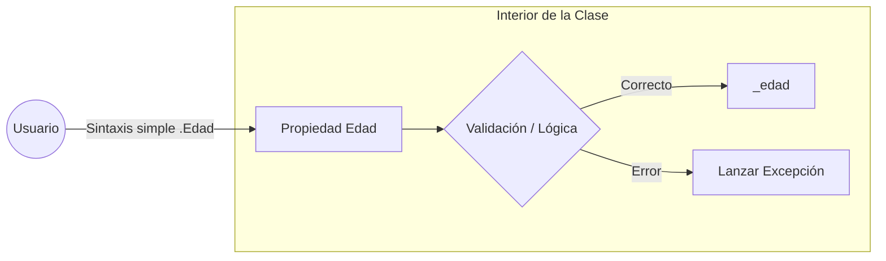
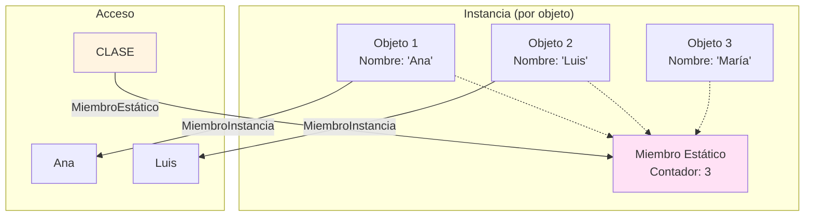

- [7. Encapsulación, Propiedades y Miembros Estáticos](#7-encapsulación-propiedades-y-miembros-estáticos)
  - [7.1 Getters y Setters](#71-getters-y-setters)
    - [7.1.1 Métodos GetX() y SetX()](#711-métodos-getx-y-setx)
    - [7.1.2 Encapsulación clásica y ejemplos](#712-encapsulación-clásica-y-ejemplos)
    - [7.1.3 Ventajas de migrar a propiedades](#713-ventajas-de-migrar-a-propiedades)
  - [7.2 Propiedades en C#](#72-propiedades-en-c)
    - [7.2.1 Propósito y por qué usar propiedades](#721-propósito-y-por-qué-usar-propiedades)
    - [7.2.2 Auto-implemented properties](#722-auto-implemented-properties)
    - [7.2.3 Propiedades de solo lectura (get-only)](#723-propiedades-de-solo-lectura-get-only)
    - [7.2.4 Init-only properties (get; init;)](#724-init-only-properties-get-init)
    - [7.2.5 Accesibilidad diferenciada en accesores](#725-accesibilidad-diferenciada-en-accesores)
    - [7.2.6 Expression-bodied properties](#726-expression-bodied-properties)
    - [7.2.7 Propiedades calculadas (computed properties)](#727-propiedades-calculadas-computed-properties)
    - [7.2.8 Propiedades con backing field (full properties)](#728-propiedades-con-backing-field-full-properties)
      - [Usos comunes de backing fields](#usos-comunes-de-backing-fields)
    - [7.2.9 Buenas prácticas y convenciones](#729-buenas-prácticas-y-convenciones)
  - [7.3 Miembros estáticos: métodos y propiedades de clase](#73-miembros-estáticos-métodos-y-propiedades-de-clase)
    - [7.3.1 Métodos static y propiedades static: sintaxis y uso](#731-métodos-static-y-propiedades-static-sintaxis-y-uso)
    - [7.3.2 Propiedades estáticas inmutables (static readonly / const)](#732-propiedades-estáticas-inmutables-static-readonly--const)
    - [7.3.3 Constructor estático y orden de inicialización](#733-constructor-estático-y-orden-de-inicialización)
    - [7.3.4 Uso práctico: utilidades, contadores, cachés](#734-uso-práctico-utilidades-contadores-cachés)
    - [7.3.5 Clases estáticas: utilidad y restricciones](#735-clases-estáticas-utilidad-y-restricciones)
  - [7.4 Resumen de Modificadores en C#](#74-resumen-de-modificadores-en-c)
    - [7.4.1. Modificadores de Acceso (Visibilidad)](#741-modificadores-de-acceso-visibilidad)
      - [Ejemplo de Restricción de Accesores](#ejemplo-de-restricción-de-accesores)
    - [7.4.2. Modificadores de Estado](#742-modificadores-de-estado)
      - [**`static`**](#static)
      - [Ejemplo con `static`](#ejemplo-con-static)
      - [**`readonly`**](#readonly)
      - [Ejemplo con `readonly`](#ejemplo-con-readonly)
    - [7.4.3. Inicialización y Accesorios](#743-inicialización-y-accesorios)
      - [**`get`, `set`, `init`**](#get-set-init)
      - [Ejemplo de `get`, `set`, y `init`](#ejemplo-de-get-set-y-init)
    - [7.4.4. Obligatoriedad y Lazy Loading](#744-obligatoriedad-y-lazy-loading)
      - [**`required`**](#required)
      - [Diferencia Clave entre `required` e `init`](#diferencia-clave-entre-required-e-init)
      - [Ejemplo con `required`](#ejemplo-con-required)
      - [**`Lazy<T>`**](#lazyt)
      - [Ejemplo con `Lazy<T>`](#ejemplo-con-lazyt)


# 7. Encapsulación, Propiedades y Miembros Estáticos

En este capítulo exploraremos cómo proteger el estado de los objetos y cómo definir miembros que pertenecen a la clase en su conjunto, utilizando las herramientas modernas que ofrece C#.

## 7.1 Getters y Setters

Los **getters** y **setters** son métodos especiales que permiten acceder y modificar los atributos privados de una clase de forma controlada. Recuerda que por principio de ocultación, los atributos deben ser privados y no accesibles directamente desde fuera de la clase. Esto ayuda a proteger el estado interno del objeto y a mantener su integridad (encapsulamiento).

### 7.1.1 Métodos GetX() y SetX()

**Ejemplo:**
```csharp
public class Perro
{
    private int edad;
    public int GetEdad() => edad;
    public void SetEdad(int valor) => edad = valor;
}
```

### 7.1.2 Encapsulación clásica y ejemplos

Permite controlar cómo se accede y cambia el estado, por ejemplo, añadiendo validaciones.

**Ejemplo con validación:**
```csharp
public class Persona
{
    private int edad;
    public int GetEdad() => edad;
    public void SetEdad(int valor) {
        if (valor < 0) throw new ArgumentException("La edad no puede ser negativa");
        edad = valor;
    }
}
```

### 7.1.3 Ventajas de migrar a propiedades

Las **propiedades** (`get`/`set`) de C# son más limpias y potentes, permiten utilizar sintaxis de atributo pero con la seguridad y control de los métodos.

---

## 7.2 Propiedades en C#

Las **propiedades** son una de las características más útiles de C#, ya que combinan la sencillez de los campos y la seguridad de los métodos.

### 7.2.1 Propósito y por qué usar propiedades

Permiten exponer información interna del objeto de forma controlada, pudiendo añadir validaciones, lógica, notificaciones, etc. Con ellos intentamos crear una interfaz clara y segura para interactuar con el estado del objeto.



### 7.2.2 Auto-implemented properties

Propiedades que el compilador gestiona automáticamente, ideales para objetos de datos.

**Ejemplo:**
```csharp
public class Producto
{
    public string Nombre { get; set; } // Si no se pone get y set es de ambos tipos
    public decimal Precio { get; set; }
}
```
Puedes inicializar el valor por defecto también:
```csharp
public string Descripcion { get; set; } = "Sin descripción";
```

### 7.2.3 Propiedades de solo lectura (get-only)

No tienen `set`, o sólo lo tienen privado/interno — el usuario no puede modificarlas después de crear el objeto.
**Ejemplo:**
```csharp
public class Circulo
{
    public double Radio { get; }
    public double Area => Math.PI * Radio * Radio;

    public Circulo(double radio) {
        Radio = radio;
    }
}
```

### 7.2.4 Init-only properties (get; init;)

Solo pueden asignarse durante inicialización (constructor o `new { ... }`). Aumentan la inmutabilidad y seguridad.
```csharp
public class Usuario
{
    public string Nombre { get; init; }
    public int Edad { get; init; }
}

var usuario = new Usuario { Nombre = "Ana", Edad = 25 };
// usuario.Edad = 30; // Error: no se puede modificar después de la inicial
```

### 7.2.5 Accesibilidad diferenciada en accesores

Puedes decidir quién puede leer o escribir cada propiedad:
```csharp
public string Clave { get; private set; }
```

### 7.2.6 Expression-bodied properties

Sintaxis corta para propiedades calculadas, son propiedades que devuelven un valor basado en otros atributos:
```csharp
public int Area => Alto * Ancho;
```

### 7.2.7 Propiedades calculadas (computed properties)

Permiten devolver, por ejemplo, el nombre completo a partir de otras propiedades:
```csharp
public string NombreCompleto => $"{Nombre} {Apellidos}";
```

### 7.2.8 Propiedades con backing field (full properties)

Cuando necesitas lógica, validación o transformar datos antes de guardarlos. Son fundamentales para mantener la integridad del estado del objeto.

**Ejemplo:**
```csharp
private int _edad;
public int Edad {
    get => _edad;
    set {
        if (value < 0) throw new ArgumentException("La edad no puede ser negativa");
        _edad = value;
    }
}
```

Desde C# 14 puedes usar contextualmente **field** para referirte al backing field sin declararlo explícitamente:
```csharp
class Empleado
{
    public decimal Salario {
        get;
        set => field = (value >= 0)
            ? value
            : throw new ArgumentOutOfRangeException(nameof(value), "El salario no puede ser negativo.");
    }
}
```

#### Usos comunes de backing fields

- **Validación en set:** Comprueba y lanza excepción si el valor no es válido.
- **Encapsulación de invariantes:** Asegura que siempre se cumplen las reglas del objeto.
- **Lazy initialization:** Inicializa sólo cuando se necesita (ideal para objetos costosos).
- **Normalización de entradas:** Ajusta valores antes de almacenarlos (ejemplo: convertir nombres a mayúsculas).
- **Notificación de cambios:** Útil en interfaces; puedes avisar si una propiedad cambia (INotifyPropertyChanged).

**Ejemplos con backing fields C# 14 +:**
```csharp
public class Producto
{
    string Nombre {
        get;
        set => field = value?.Trim() ?? throw new ArgumentNullException(nameof(value), "El nombre no puede ser nulo.");
    }
    decimal Precio {
        get;
        set => field = (value >= 0)
            ? value
            : throw new ArgumentOutOfRangeException(nameof(value), "El precio no puede ser negativo.");
    }
}
```

### 7.2.9 Buenas prácticas y convenciones

- Usa PascalCase para los nombres.
- Prefiere propiedades auto-implementadas salvo que necesites lógica adicional.
- Usa backing fields si hay validación, transformación o control especial.

---

## 7.3 Miembros estáticos: métodos y propiedades de clase

Los **miembros estáticos** pertenecen a la clase, no a una instancia concreta. ¿Qué quiere decir esto? Significa que puedes acceder a ellos sin crear un objeto de esa clase. Es la propia clase la que se encarga de contenerlos y gestionarlos. **Son elementos compartidos** entre todas las instancias de la clase (objetos).

Son útiles para datos o comportamientos compartidos por todas las instancias, o para utilidades generales.

### 7.3.1 Métodos static y propiedades static: sintaxis y uso

**Ejemplo:**
```csharp
public class Matematica
{
    public static double Sumar(double a, double b) => a + b;
}

// Uso:
double resultado = Matematica.Sumar(3, 5);
```

### 7.3.2 Propiedades estáticas inmutables (static readonly / const)

- **const:** valor fijo en tiempo de compilación.
- **static readonly:** valor fijo en tiempo de ejecución, se puede inicializar en el constructor estático.

### 7.3.3 Constructor estático y orden de inicialización

Se usa para inicializar datos compartidos de la clase antes de que se use cualquier miembro.
```csharp
public class Configuracion
{
    public static readonly string RutaConfig;

    static Configuracion() {
        RutaConfig = "/etc/config";
    }
}

var ruta = Configuracion.RutaConfig;
Console.WriteLine(ruta); // Imprime: /etc/config
```

### 7.3.4 Uso práctico: utilidades, contadores, cachés

Por ejemplo, contar cuántos objetos se han creado:
```csharp
public class Ejemplo
{
    public static int ContadorInstancias { get; private set; }
    public Ejemplo() => ContadorInstancias++;
}


var e1 = new Ejemplo();
var e2 = new Ejemplo();
Console.WriteLine(Ejemplo.ContadorInstancias); // Imprime: 2

```

### 7.3.5 Clases estáticas: utilidad y restricciones

Una clase estática sólo puede tener miembros estáticos y no puede instanciarse. Útil para métodos de utilidad.
```csharp
public static class Utilidades
{
    public static int Max(int a, int b) => (a > b) ? a : b;
}

var maximo = Utilidades.Max(10, 20);
```

---

## 7.4 Resumen de Modificadores en C#

Las **propiedades** son miembros de una clase o *struct* que proporcionan un mecanismo flexible para acceder a campos privados. Exponen el dato a través de bloques de código llamados **accesores** (`get`, `set`, `init`), permitiendo la lógica de validación, cálculo o acceso diferido.

### 7.4.1. Modificadores de Acceso (Visibilidad)

Estos modificadores se usan para controlar qué partes del código pueden interactuar con la propiedad o con sus accesores individuales.   

| Modificador     | Alcance                                                      | Descripción                                                                            | Ejemplo                                          |
| :-------------- | :----------------------------------------------------------- | :------------------------------------------------------------------------------------- | :----------------------------------------------- |
| **`public`**    | **Todo** el código.                                          | Acceso sin restricciones desde cualquier parte del programa.                           | `public string Nombre { get; set; }`             |
| **`private`**   | **Solo** la clase o *struct* contenedora.                    | Limita el acceso únicamente a los métodos y miembros de la clase donde está declarada. | `private decimal CostoInterno { get; set; }`     |
| **`internal`**  | **Solo** el ensamblado (proyecto) actual.                    | El acceso está limitado a los tipos definidos dentro del mismo ensamblado.             | `internal bool EstaEnOferta { get; set; }`       |
| **`protected`** | La clase contenedora **y** las clases derivadas (herederas). | El acceso se permite en la clase base y en cualquier clase que herede de ella.         | `protected DateTime FechaCreacion { get; set; }` |

#### Ejemplo de Restricción de Accesores

Se puede restringir la accesibilidad de un accesor (`set` o `get`) siempre que sea **más restrictivo** que el modificador de la propiedad principal:

```csharp
public class Producto
{
    // La propiedad es pública para leer, pero solo la clase 'Producto' puede modificarla.
    public decimal Precio { get; private set; }

    // La propiedad es interna para leer, pero solo la clase 'Producto' (y sus herederas)
    // pueden establecerla (protected set es más restrictivo que internal get).
    internal string Codigo { get; protected set; }

    public Producto(string codigo, decimal precio)
    {
        // El 'private set' y 'protected set' son accesibles desde aquí (dentro de la clase).
        Codigo = codigo;
        Precio = precio;
    }
}
```

### 7.4.2. Modificadores de Estado

#### **`static`**

| Característica     | Descripción                                                                         |
| :----------------- | :---------------------------------------------------------------------------------- |
| **Propósito**      | La propiedad pertenece a la **clase**, no a una instancia individual (objeto).      |
| **Comportamiento** | Hay una única copia de esta propiedad compartida por todos los objetos de la clase. |
| **Uso Común**      | Contadores, constantes o *logs* de actividad de la clase.                           |

#### Ejemplo con `static`

```csharp
public class Pedido
{
    // Contador global para todos los pedidos
    public static int TotalPedidos { get; private set; } = 0;

    public Pedido()
    {
        TotalPedidos++; // Se incrementa cada vez que se crea un nuevo pedido
    }
}

// Uso:
// Acceso directo a través de la clase, no de una instancia
Console.WriteLine(Pedido.TotalPedidos); // 0
var p1 = new Pedido();
var p2 = new Pedido();
Console.WriteLine(Pedido.TotalPedidos); // 2
```

#### **`readonly`**

| Característica     | Descripción                                                                                   |
| :----------------- | :-------------------------------------------------------------------------------------------- |
| **Propósito**      | Garantiza que un **campo de respaldo** (o un campo en general) solo se pueda asignar una vez. |
| **Comportamiento** | Solo se puede inicializar en: 1) La declaración o 2) El constructor.                          |
| **Uso Común**      | Inmutabilidad y seguridad de que un valor no cambiará después de la construcción.             |

#### Ejemplo con `readonly`

```csharp
public class Config
{
    // Campo de respaldo 'readonly'
    private readonly string _nombreServidor;

    // Propiedad de solo lectura que expone el campo
    public string NombreServidor => _nombreServidor; // Solo tiene 'get'

    public Config(string nombre)
    {
        // ÚNICO lugar fuera de la declaración donde se puede asignar:
        _nombreServidor = nombre;
    }

    // public void IntentarCambiar() { _nombreServidor = "otro"; } // ERROR: El campo es readonly.
}
```

### 7.4.3. Inicialización y Accesorios

#### **`get`, `set`, `init`**

Estos son los **accesores** que definen cómo se lee (`get`) y cómo se escribe (`set`/`init`) el valor de la propiedad.

| Accesor    | Propósito                                     | Comportamiento                                                                                                      |
| :--------- | :-------------------------------------------- | :------------------------------------------------------------------------------------------------------------------ |
| **`get`**  | Lectura de valor.                             | Contiene la lógica para devolver el valor de la propiedad.                                                          |
| **`set`**  | Escritura de valor (**mutable**).             | Permite cambiar el valor en **cualquier momento** después de la creación del objeto.                                |
| **`init`** | Escritura de valor (**solo inicialización**). | Permite cambiar el valor **solo** durante la inicialización del objeto (C\# 9). Después, se vuelve de solo lectura. |

#### Ejemplo de `get`, `set`, y `init`

```csharp
public class Empleado
{
    // Propiedad con 'set': Se puede modificar en cualquier momento
    public string Puesto { get; set; } = "Junior";

    // Propiedad con 'init': Solo se puede establecer al crear el objeto
    public int IdEmpleado { get; init; }

    // Propiedad calculada (solo 'get')
    public string NombreCompleto { get; }

    public Empleado(string nombreCompleto)
    {
        NombreCompleto = nombreCompleto; // Asignación válida dentro del constructor
    }
}

// Uso:
var e = new Empleado("Ana García")
{
    IdEmpleado = 101 // Válido: Inicializador de objeto
};

e.Puesto = "Senior"; // Válido: Tiene 'set'
// e.IdEmpleado = 102; // ERROR: Es 'init-only', no se puede reasignar fuera de la inicialización
```

### 7.4.4. Obligatoriedad y Lazy Loading

#### **`required`**

| Característica     | Descripción                                                                                                                                  |
| :----------------- | :------------------------------------------------------------------------------------------------------------------------------------------- |
| **Propósito**      | Obligar al código cliente a inicializar la propiedad.                                                                                        |
| **Comportamiento** | El compilador genera un error si la propiedad `required` no se establece durante la creación del objeto (en el constructor o inicializador). |
| **Uso Común**      | Garantizar que un objeto siempre se encuentre en un estado válido.                                                                           |

#### Diferencia Clave entre `required` e `init`

**`init`** controla *cuándo* se puede asignar (solo al inicio), pero **no obliga** a que se asigne.

**`required`** controla *si* se debe asignar, y **obliga** a que tenga un valor inicial.

| Propiedad                                 | Definición | ¿Obliga a inicializar? | ¿Permite cambiar luego? |
| :---------------------------------------- | :--------- | :--------------------- | :---------------------- |
| `public string A { get; set; }`           | No         | Sí (con `set`)         |
| `public string B { get; init; }`          | No         | No                     |
| `public required string C { get; set; }`  | **Sí**     | Sí (con `set`)         |
| `public required string D { get; init; }` | **Sí**     | No                     |

#### Ejemplo con `required`

```csharp
public class ConfiguracionBBDD
{
    // OBLIGATORIO: La cadena de conexión debe ser proporcionada por el usuario.
    public required string CadenaConexion { get; init; }

    // OPCIONAL: Se establece un valor por defecto si no se da uno.
    public int Timeout { get; init; } = 30;
}

// Uso correcto:
var config1 = new ConfiguracionBBDD { CadenaConexion = "Server=LocalDB" };

// Uso INCORRECTO:
// var config2 = new ConfiguracionBBDD { Timeout = 60 };
// ERROR de compilación: La propiedad 'CadenaConexion' es required y no se ha inicializado.
```

#### **`Lazy<T>`**

| Característica     | Descripción                                                                                                                                 |
| :----------------- | :------------------------------------------------------------------------------------------------------------------------------------------ |
| **Propósito**      | Implementar la **inicialización diferida** (*Lazy Loading* o carga perezosa).                                                               |
| **Comportamiento** | El código de inicialización solo se ejecuta cuando se accede a la propiedad por primera vez.                                                |
| **Uso Común**      | Cargar recursos pesados, configurar objetos complejos o realizar operaciones costosas solo si son estrictamente necesarios. |

#### Ejemplo con `Lazy<T>`

```csharp
// Un objeto que toma mucho tiempo en construirse
public class ReporteMensual {
    public ReporteMensual() {
        Thread.Sleep(5000); // Simula una carga de 5 segundos
        Console.WriteLine("Reporte creado.");
    }
}

public class Dashboard
{
    // El objeto 'ReporteMensual' NO se crea cuando se crea el 'Dashboard'
    private readonly Lazy<ReporteMensual> _reporteLazy = new(() => new ReporteMensual());

    // La propiedad expone el valor y activa la creación al primer acceso
    public ReporteMensual DatosReporte => _reporteLazy.Value;

    public void MostrarResumen()
    {
        Console.WriteLine("Mostrando resumen rápido...");
        // El reporte NO se ha creado todavía
    }
}

// Uso:
var dash = new Dashboard();
dash.MostrarResumen(); // Inmediato.

// SOLO al acceder aquí por primera vez se ejecuta el constructor de ReporteMensual
var datos = dash.DatosReporte; // Tarda 5 segundos y se imprime "Reporte creado."
```

> 📝 **Truco del Examinador:** Pregunta típica: "¿Cuándo usar `static` vs instancia?"
> - **static**: Para datos/métodos que pertenecen a la CLASE (contadores, utilidades, configuraciones globales)
> - **Instancia**: Para datos/métodos específicos de cada OBJETO (nombre de una persona, edad de un gato)

> 💡 **Regla nemotécnica:** "Lo estático se queda en la clase, lo de instancia viaja con el objeto."



> 💡 **Analogía del hotel:** Imagina un hotel con réception global (static) y habitaciones individuales (instancia). El mostrador de recepción es único para todos (contador de huéspedes), pero cada habitación tiene sus propios datos (nombre del huésped, fecha de entrada).

> 📝 **Nota del Profesor:** "El principio de encapsulamiento se resume en: 'Oculta lo que no necesito mostrar, protege lo que no quiero que cambie.' Las propiedades son la herramienta perfecta para esto."

**Comparativa rápida de modificadores:**

| Modificador | ¿Pertenece a...? | ¿Cuándo inicializar? | ¿Se puede cambiar? |
|-------------|------------------|----------------------|-------------------|
| `const` | Clase | Compilación | Nunca |
| `static readonly` | Clase | Tiempo de ejecución | Nunca |
| `readonly` (campo) | Instancia | Constructor | Nunca |
| `get; set;` | Instancia | Cuando quieras | Sí |
| `get; init;` | Instancia | Solo al crear | No |
| `static` | Clase | Cuando se usa | Sí |
