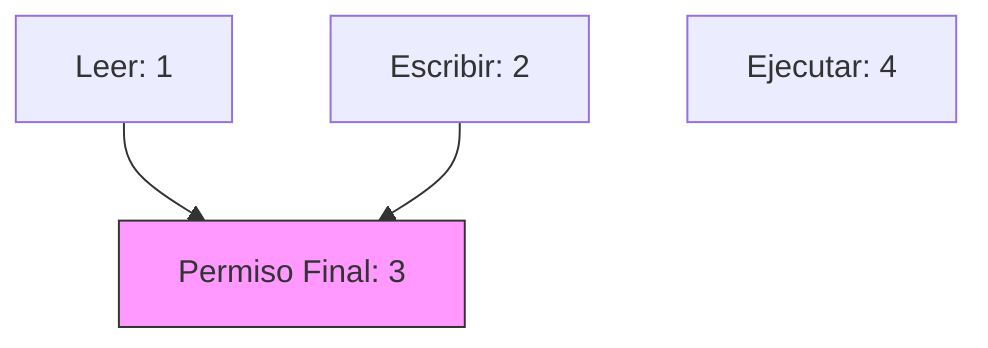

- [8. Enums, Structs y Records](#8-enums-structs-y-records)
  - [8.1 Enums (Enumerados)](#81-enums-enumerados)
    - [8.1.1 Definición básica y uso](#811-definición-básica-y-uso)
    - [8.1.2 Asignación de valores específicos](#812-asignación-de-valores-específicos)
    - [8.1.3 String representation y parsing](#813-string-representation-y-parsing)
    - [8.1.4 Flags enum y operaciones bit a bit](#814-flags-enum-y-operaciones-bit-a-bit)
  - [8.2 Structs y Records](#82-structs-y-records)
    - [8.2.1 Structs (Value types)](#821-structs-value-types)
      - [Pasos por valor vs por referencia](#pasos-por-valor-vs-por-referencia)
    - [8.2.2 Record Class](#822-record-class)
    - [8.2.3 Record Struct](#823-record-struct)
    - [8.2.4 Comparativa: class vs struct vs record](#824-comparativa-class-vs-struct-vs-record)
    - [8.2.5 Tipos anónimos y Tuplas](#825-tipos-anónimos-y-tuplas)


# 8. Enums, Structs y Records

En este capítulo analizaremos tipos de datos que, aunque comparten similitudes con las clases, tienen propósitos y comportamientos en memoria muy diferentes: los enumerados, las estructuras y los registros.

## 8.1 Enums (Enumerados)

Los **enums** te permiten definir un conjunto de valores posibles para un tipo. Se usan para representar opciones limitadas y conocidas. En el fondo, son números enteros con nombres legibles para los humanos.

### 8.1.1 Definición básica y uso

**Ejemplo:**
```csharp
public enum Color { Rojo, Verde, Azul }
Color miColor = Color.Azul;
```

### 8.1.2 Asignación de valores específicos
Puedes asignar valores específicos a cada miembro del enum. Si no se asignan, empiezan en 0 y aumentan en 1.
```csharp
public enum DiaSemana 
{ 
    Lunes = 1, 
    Martes = 2, 
    Miercoles = 3, 
    Jueves = 4, 
    Viernes = 5, 
    Sabado = 6, 
    Domingo = 7 
}

DiaSemana hoy = DiaSemana.Miercoles;
int valor = (int)hoy; // valor será 3

// Se puede convertir un número a Enum mediante casting
DiaSemana dia = (DiaSemana)5; // dia será DiaSemana.Viernes
```

### 8.1.3 String representation y parsing
Puedes convertir enums a cadenas y viceversa de forma sencilla:
```csharp
Color color = Color.Rojo;
string nombreColor = color.ToString(); // "Rojo"

// Convertir string a Enum (Parsing)
Color color2 = (Color)Enum.Parse(typeof(Color), "Verde");
```

### 8.1.4 Flags enum y operaciones bit a bit
Puedes combinar valores para indicar varias opciones simultáneas usando el atributo `[Flags]`. Esto es muy útil para sistemas de permisos o configuraciones.



```csharp
[Flags]
public enum Permiso 
{ 
    Ninguno = 0,
    Leer = 1, 
    Escribir = 2, 
    Ejecutar = 4 
}

// Combinar permisos con el operador OR (|)
Permiso p = Permiso.Leer | Permiso.Escribir; 

// Verificar permisos con el operador AND (&) o .HasFlag
bool puedeEscribir = p.HasFlag(Permiso.Escribir); // true
```

---

## 8.2 Structs y Records

### 8.2.1 Structs (Value types)

Los **structs** son tipos por **valor**. A diferencia de las clases, cuando copias un struct, creas una copia independiente de todos sus datos.

- Se usan para datos pequeños e inmutables (puntos, colores, coordenadas).
- Representan valores que tienen un significado propio sin identidad única.
- No pueden tener herencia de otros structs o clases.
- Se almacenan normalmente en la pila (**Stack**), lo que los hace muy rápidos.

**Ejemplo:**
```csharp
public struct Punto
{
    public int X { get; }
    public int Y { get; }
    public Punto(int x, int y) => (X, Y) = (x, y);
}
```

#### Pasos por valor vs por referencia
Es crucial entender cómo se comportan al pasarlos a métodos:
- **Struct**: Se pasa una copia (por valor). Si lo modificas dentro, el original no cambia.
- **Clase**: Se pasa una referencia. Si lo modificas dentro, el objeto original cambia.

```mermaid
graph LR
    subgraph STACK [Memoria STACK]
        V1[Struct A] --> V2[Copia Struct A]
    end
    subgraph HEAP [Memoria HEAP]
        C1[Clase B]
    end
    REF[Ref Var B] --> C1
    REF2[Ref Copia B] --> C1
    Note over V1,V2: Datos independientes
    Note over REF,REF2: Apuntan al mismo sitio
```

### 8.2.2 Record Class

Los **records** son tipos por referencia que introducen la **igualdad por valor**. Son ideales para modelos de datos inmutables (DTO).

- Generan automáticamente `Equals`, `GetHashCode` y `ToString`.
- Soportan la expresión `with` para crear copias modificadas.

**Ejemplo:**
```csharp
public record Persona(string Nombre, int Edad);

var p1 = new Persona("Juan", 30);
var p2 = p1 with { Edad = 31 }; // Crea una copia con la edad cambiada

Console.WriteLine(p1 == p2); // False
Console.WriteLine(p1); // Imprime: Persona { Nombre = Juan, Edad = 30 }
```

### 8.2.3 Record Struct

Son como los records, pero son tipos por **valor**. Se recomiendan para datos pequeños que necesiten la comodidad de los records (igualdad automática y representación) pero la gestión de memoria de los structs.

### 8.2.4 Comparativa: class vs struct vs record

| Característica | Class | Struct | Record |
| :--- | :--- | :--- | :--- |
| **Semántica** | Entidad con identidad única. | Valor simple / Dato. | Dato / Modelo inmutable. |
| **Memoria** | Referencia (Heap). | Valor (Stack). | Ref (class) o Valor (struct). |
| **Copia** | Copia de referencia. | Copia de todos los datos. | Copia profunda (with). |
| **Igualdad** | Por identidad (referencia). | Por valor (campos). | Por valor (automática). |

**¿Cuándo usar cada uno?**
- **Class**: Para objetos con "vida" y comportamiento complejo (Factura, Usuario).
- **Struct**: Para valores matemáticos o datos muy pequeños que se crean y destruyen rápido.
- **Record**: Para contenedores de datos que solo sirven para transportar información.

### 8.2.5 Tipos anónimos y Tuplas

Permiten agrupar datos de forma rápida sin definir una clase o struct formal.

**Tipos Anónimos:**
```csharp
var anon = new { Nombre = "Juan", Edad = 30 };
```

**Tuplas (ValueTuples):**
```csharp
var tupla = (Nombre: "Ana", Edad: 25);
Console.WriteLine(tupla.Nombre); // Ana
```
