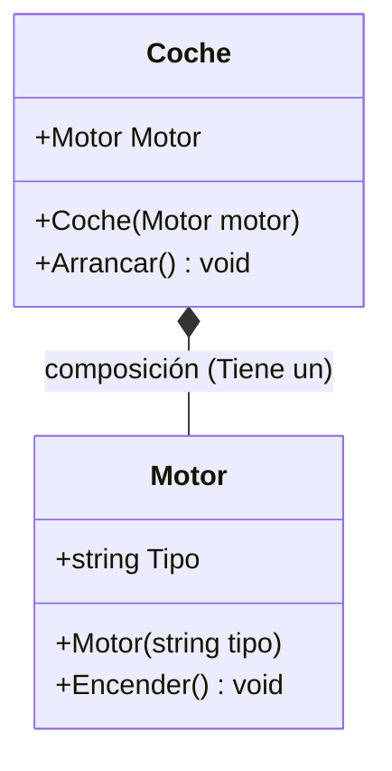

- [9. Clases Anidadas y Composición](#9-clases-anidadas-y-composición)
  - [9.1 Clases anidadas](#91-clases-anidadas)
    - [9.1.1 Nested classes (estáticas vs de instancia)](#911-nested-classes-estáticas-vs-de-instancia)
    - [9.1.2 Escenarios de uso](#912-escenarios-de-uso)
  - [9.2 Composición de objetos](#92-composición-de-objetos)
    - [9.2.1 Contener objetos como campos/propiedades](#921-contener-objetos-como-campospropiedades)
    - [9.2.2 Ventajas frente a herencia](#922-ventajas-frente-a-herencia)


# 9. Clases Anidadas y Composición

En este capítulo aprenderemos técnicas avanzadas para organizar nuestras clases y cómo construir objetos complejos a partir de piezas más simples, aplicando el principio de "reutilización sobre herencia".

## 9.1 Clases anidadas

Las **clases anidadas** son clases definidas dentro de otras clases. Son útiles para agrupar tipos relacionados que solo tienen sentido dentro del contexto de la clase contenedora.

### 9.1.1 Nested classes (estáticas vs de instancia)

Una clase interna puede acceder a miembros de la clase externa si estos son accesibles. Esto permite una encapsulación más estrecha.

**Ejemplo:**
```csharp
public class Persona
{
    public string Nombre { get; set; }

    // Clase anidada
    public class Documento
    {
        public string Tipo { get; set; } // DNI, Pasaporte, etc.
        public string Numero { get; set; }
    }
}

// Uso:
var p = new Persona { Nombre = "José" };
var doc = new Persona.Documento { Tipo = "DNI", Numero = "12345678Z" };
```

### 9.1.2 Escenarios de uso

Úsalas para agrupar tipos que sólo tienen sentido dentro de otro, o para evitar crear archivos extra para clases de utilidad muy pequeñas. Es especialmente útil en patrones como el **Builder** (donde el Builder suele ser una clase anidada de la clase que construye).

---

## 9.2 Composición de objetos

La **composición** es un patrón fundamental en POO: consiste en construir objetos que contienen otros objetos como parte de su estado. Representa una relación de **"tiene un"** o **"es parte de"**.

### 9.2.1 Contener objetos como campos/propiedades

Cuando una clase contiene a otra, decimos que la clase principal depende de la clase contenida.

**Ejemplo:**
```csharp
public class Motor
{
    public string Tipo { get; }
    public Motor(string tipo) => Tipo = tipo;
    public void Encender() => Console.WriteLine("Motor encendido");
}

public class Coche
{
    public Motor Motor { get; }
    
    // Inyectamos el motor en el constructor
    public Coche(Motor motor) 
    {
        Motor = motor;
    }
    
    public void Arrancar() => Motor.Encender();
}
```

Aquí, la clase `Coche` se compone de un `Motor`. Esto permite reutilizar la clase `Motor` en otros contextos (por ejemplo, en un camión o una lancha) y facilita el mantenimiento. 



En este diseño, el `Coche` tiene una dependencia hacia el `Motor`. Por lo tanto, debemos **"inyectar"** el objeto `Motor` en el constructor de `Coche`.

```csharp
var motorV8 = new Motor("V8");
var miCoche = new Coche(motorV8);
miCoche.Arrancar(); // Imprime: Motor encendido
```

### 9.2.2 Ventajas frente a herencia

Aunque la herencia es potente, la composición suele ser preferible en muchos diseños de software (principio "Favor composition over inheritance") por las siguientes razones:

- **Más flexible**: Puedes cambiar el motor de un coche en tiempo de ejecución (si el código lo permite), pero no puedes cambiar la clase de la que hereda un objeto.
- **Menos acoplamiento**: Las clases son más independientes. El coche no necesita saber cómo funciona el motor por dentro, solo cómo encenderlo.
- **Más fácil de extender y testear**: Puedes probar la clase `Motor` por separado antes de usarla en `Coche`.
