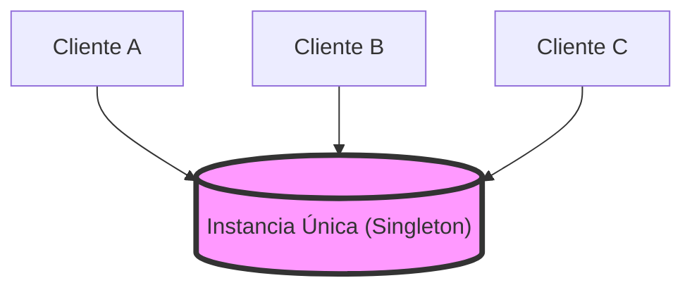
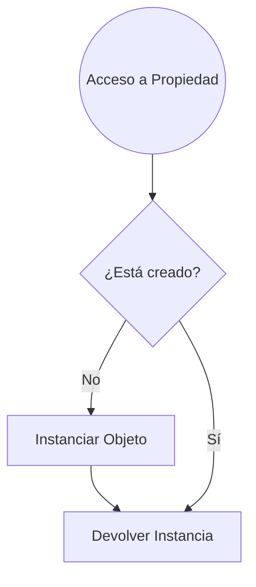
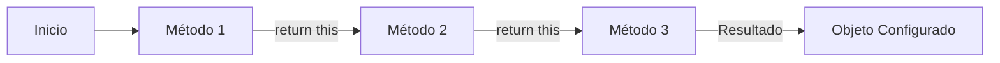
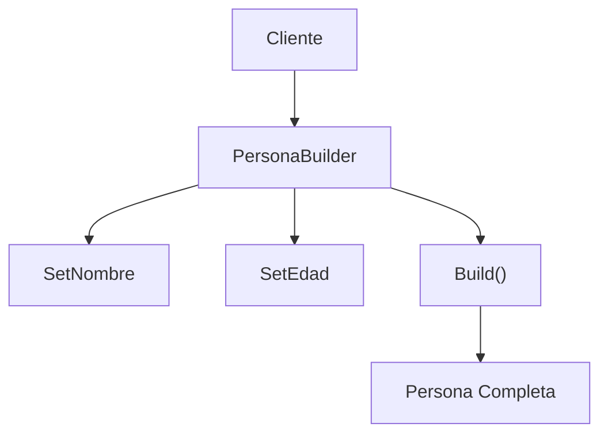
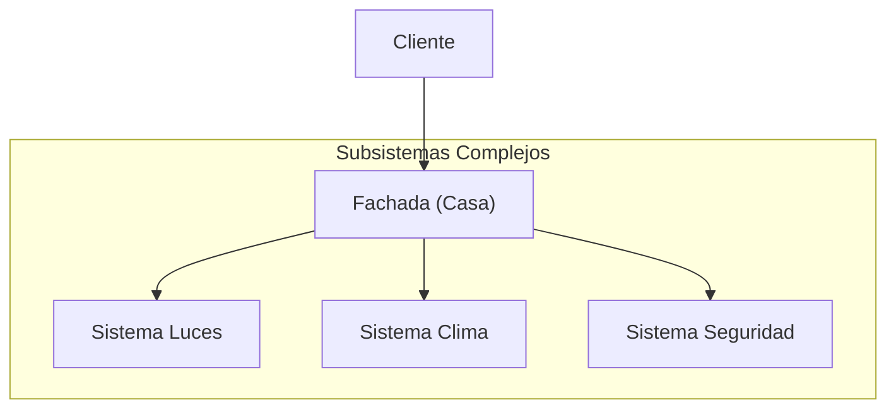
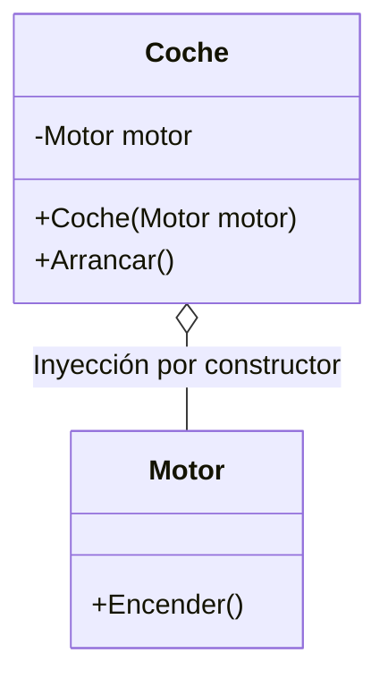

- [10. Patrones básicos de diseño orientados a objetos](#10-patrones-básicos-de-diseño-orientados-a-objetos)
  - [10.1 Singleton](#101-singleton)
  - [10.2 Lazy o perezoso](#102-lazy-o-perezoso)
  - [10.3 Métodos fábrica (factory methods / static creators)](#103-métodos-fábrica-factory-methods--static-creators)
  - [10.4 Inicializadores estáticos (static constructors)](#104-inicializadores-estáticos-static-constructors)
  - [10.5 Instanciación y buenas prácticas para records y structs](#105-instanciación-y-buenas-prácticas-para-records-y-structs)
  - [10.6 Fluent pattern / Fluent API](#106-fluent-pattern--fluent-api)
  - [10.7 Builder](#107-builder)
  - [10.8 Fachada (facade)](#108-fachada-facade)
  - [10.9 Composición e inyección de dependencias por constructor](#109-composición-e-inyección-de-dependencias-por-constructor)


# 10. Patrones básicos de diseño orientados a objetos

Aquí se presentan patrones fundamentales para la construcción de objetos y el diseño de sistemas. Los patrones de diseño son soluciones probadas a problemas comunes en el desarrollo de software.

## 10.1 Singleton

Asegura que solo haya una instancia de una clase en todo el programa.



**Ejemplo clásico:**
```csharp
public sealed class Config
{
    private static Config instancia = null;
    private Config() { }
    public static Config ObtenerInstancia() {
        if (instancia == null) {
            instancia = new Config();
        }
        return instancia;
    }
}
```

Otra forma más sencilla y segura en C# es usar un campo estático readonly:
```csharp
public sealed class Config
{
    private static readonly Config instancia = new Config();
    private Config() { }
    public static Config ObtenerInstancia() => instancia;
}
```

---

## 10.2 Lazy o perezoso

Se usa para retrasar la creación de un objeto hasta que se necesite, optimizando recursos, especialmente útil en singletons, o cuando la creación del objeto es costosa ahorrando tiempo y memoria si no se usa.



- **Pros:** Ahorra recursos, mejora el rendimiento inicial.
- **Contras:** Añade complejidad, puede complicar el manejo de errores. Puede ser más lento la primera vez que se accede.

```csharp
public class RecursoCostoso
{
    private static readonly Lazy<RecursoCostoso> instancia =
        new Lazy<RecursoCostoso>(() => new RecursoCostoso());

    private RecursoCostoso() { }

    public static RecursoCostoso Instancia => instancia.Value;
}
```

---

## 10.3 Métodos fábrica (factory methods / static creators)

Permiten encapsular la lógica de creación de objetos. Con ellos puedes controlar cómo se crean los objetos, aplicar validaciones, si tenemos un enum podemos devolver diferentes tipos de objetos según el valor, etc.


**Ejemplo:**
```csharp
public class Usuario
{
    public string Nombre { get; }
    private Usuario(string nombre) => Nombre = nombre;
    public static Usuario Crear(string nombre) => new Usuario(nombre);
}
```

---

## 10.4 Inicializadores estáticos (static constructors)

Se usan para inicializar datos compartidos de la clase antes de que se use cualquier miembro.

```csharp
public class Configuracion
{
    public static readonly string RutaConfig;

    static Configuracion() {
        RutaConfig = "/etc/config";
    }
}
var ruta = Configuracion.RutaConfig;
Console.WriteLine(ruta); // Imprime: /etc/config
```

---

## 10.5 Instanciación y buenas prácticas para records y structs

Prefiere inmutabilidad, inicializa todo al crear el objeto, evita valores nulos.

**Ejemplo:**
```csharp
public record Persona(string Nombre, int Edad);
var p = new Persona("Juan", 30);
var p2 = p with { Edad = 31 }; // copia modificada
```

---

## 10.6 Fluent pattern / Fluent API

Permite encadenar métodos para configurar objetos de forma fluida para ello debemos devolver this en los métodos de configuración.



**Ejemplo:**
```csharp
public class Consulta
{
    private string tabla = "";
    private string condicion = "";
    public Consulta From(string tabla)
    {
        this.tabla = tabla;
        return this;
    }
    public Consulta Where(string condicion)
    {
        this.condicion = condicion;
        return this;
    }
    public string Build()
    {
        return $"SELECT * FROM {tabla} WHERE {condicion}";
    }
}

var consulta = new Consulta()
    .From("Usuarios")
    .Where("Edad > 18")
    .Build();

Console.WriteLine(consulta); // Imprime: SELECT * FROM Usuarios WHERE Edad > 18
```

---

## 10.7 Builder

El **Builder** ayuda a construir objetos complejos paso a paso. De esta forma puedes crear objetos con muchas configuraciones sin necesidad de tener constructores con muchos parámetros o usar parámetros opcionales.



**Ejemplo básico:**
```csharp
public class PersonaBuilder
{
    private string nombre = "";
    private int edad = 0;
    public PersonaBuilder SetNombre(string nombre)
    {
        this.nombre = nombre;
        return this;
    }
    public PersonaBuilder SetEdad(int edad)
    {
        this.edad = edad;
        return this;
    }
    public Persona Build()
    {
        return new Persona(nombre, edad);
    }
}

var persona = new PersonaBuilder().SetNombre("Ana").SetEdad(22).Build();
```

---

## 10.8 Fachada (facade)

Agrupa múltiples operaciones complejas en una interfaz simple. De esta manera encapsula la complejidad y facilita el uso de subsistemas.



**Ejemplo:**
```csharp
public class Casa
{
    private readonly Puerta puerta = new();
    private readonly Ventana ventana = new();
    public void AbrirTodo()
    {
        puerta.Abrir();
        ventana.Abrir();
    }
    public void CerrarTodo()
    {
        puerta.Cerrar();
        ventana.Cerrar();
    }
}
```

---

## 10.9 Composición e inyección de dependencias por constructor

La composición facilita la inyección de dependencias: pasa los objetos que tu clase necesita a través del constructor.
Así el código es más flexible y fácil de cambiar o testear.



**Ejemplo:**
```csharp
class Motor
{
    public string Tipo { get; }
    public Motor(string tipo) => Tipo = tipo;
    public void Encender() => Console.WriteLine("Motor encendido");
}

class Coche
{
    private readonly Motor motor;
    public Coche(Motor motor) => this.motor = motor;
    public void Arrancar() => motor.Encender();
}

var motorV8 = new Motor("V8");
var miCoche = new Coche(motorV8);
miCoche.Arrancar(); // Imprime: Motor encendido
```
