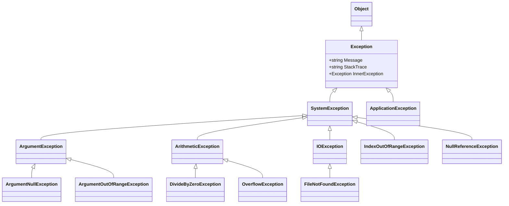
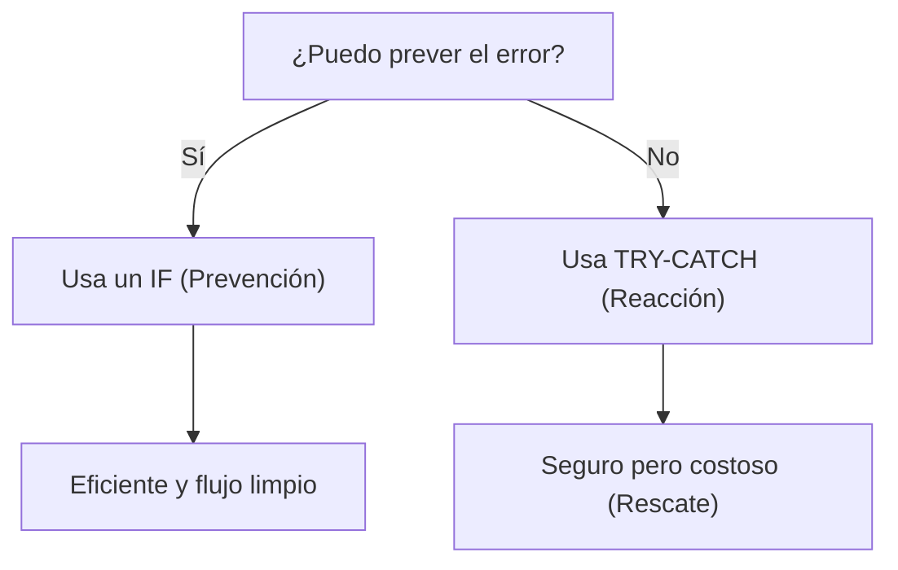
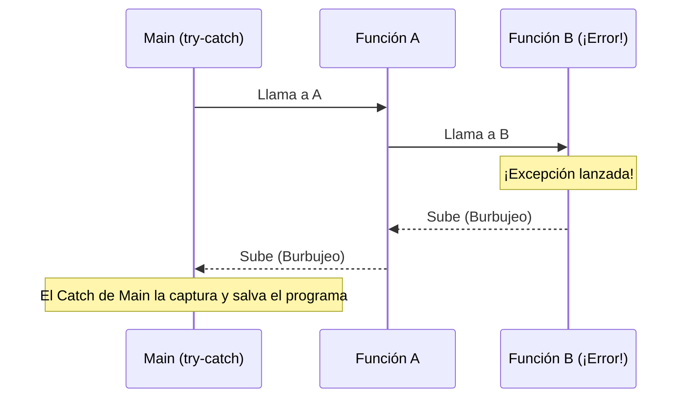
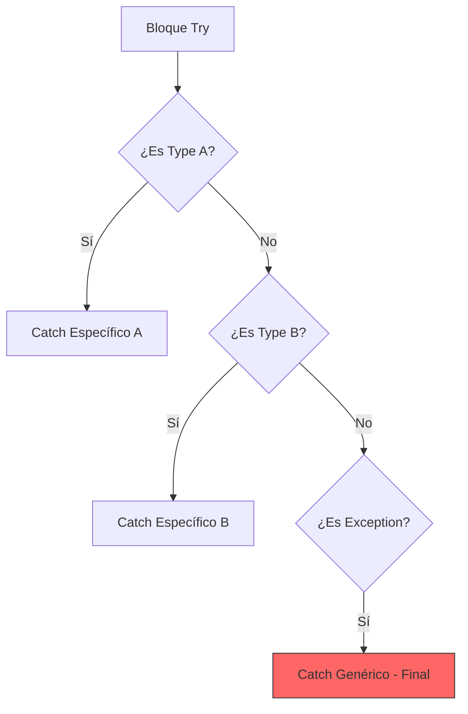

- [11. Excepciones en la Programación Orientada a Objetos](#11-excepciones-en-la-programación-orientada-a-objetos)
  - [11.1 ¿Qué es realmente una Excepción?](#111-qué-es-realmente-una-excepción)
  - [11.2 Jerarquía de Excepciones en C#](#112-jerarquía-de-excepciones-en-c)
  - [11.3 Filosofía del Manejo: Prevención vs. Reacción](#113-filosofía-del-manejo-prevención-vs-reacción)
    - [11.3.1 Prevención (El `if`): El Arquitecto Previsor](#1131-prevención-el-if-el-arquitecto-previsor)
      - [Ejemplo: Prevención en la División por Cero (Recomendado)](#ejemplo-prevención-en-la-división-por-cero-recomendado)
    - [11.3.2 Reacción (El `try-catch`): El Rescate de Emergencia](#1132-reacción-el-try-catch-el-rescate-de-emergencia)
      - [Ejemplo: Reacción en la División por Cero (No recomendado si se puede prever)](#ejemplo-reacción-en-la-división-por-cero-no-recomendado-si-se-puede-prever)
    - [11.3.3 Toma de decisiones](#1133-toma-de-decisiones)
  - [11.4 Lanzar excepciones: `throw`](#114-lanzar-excepciones-throw)
    - [11.4.1 Uso de Excepciones para Acotar Dominios](#1141-uso-de-excepciones-para-acotar-dominios)
  - [11.5 Manejo de Excepciones: `try`, `catch` y `finally`](#115-manejo-de-excepciones-try-catch-y-finally)
    - [11.5.1 El Bloque `try`: La Zona Vigilada](#1151-el-bloque-try-la-zona-vigilada)
    - [11.5.2 El Bloque `catch`: El Estado Estable y el Rollback](#1152-el-bloque-catch-el-estado-estable-y-el-rollback)
    - [11.5.3 El Bloque `finally`: La Limpieza](#1153-el-bloque-finally-la-limpieza)
  - [11.6 El Burbujeo de Excepciones (Unwinding)](#116-el-burbujeo-de-excepciones-unwinding)
  - [11.7 Excepciones Comunes y Buenas Prácticas](#117-excepciones-comunes-y-buenas-prácticas)
    - [11.7.1 Reglas de Oro](#1171-reglas-de-oro)
  - [11.8 El Orden de Captura: La Regla de la Especificidad](#118-el-orden-de-captura-la-regla-de-la-especificidad)
    - [11.8.1 De lo Específico a lo Genérico](#1181-de-lo-específico-a-lo-genérico)
    - [11.8.2 Ejemplo de Orden Correcto](#1182-ejemplo-de-orden-correcto)
    - [11.8.3 El peligro de "Comérselo todo"](#1183-el-peligro-de-comérselo-todo)


# 11. Excepciones en la Programación Orientada a Objetos

Gestionar errores correctamente es básico para tener programas robustos y profesionales. En el paradigma de la POO, los errores no son simples mensajes; son **objetos** que encapsulan toda la información sobre un fallo inesperado.

## 11.1 ¿Qué es realmente una Excepción?

Una excepción es un objeto que se crea cuando ocurre un evento inesperado que interrumpe el flujo normal de las instrucciones. Surge de la brecha entre la **predictibilidad** del código y la **impredictibilidad** del entorno real.

| Fase | Nivel de Control | Ejemplos de Fallo |
| :--- | :--- | :--- |
| **Tiempo de Compilación** | Alto (Control del programador) | Sintaxis errónea, errores de tipo. El compilador te avisa antes de ejecutar. |
| **Tiempo de Ejecución** | Bajo (Depende del entorno) | Usuario introduce texto por número, red caída, disco lleno. |

Las excepciones son el mecanismo para gestionar estos **eventos impredecibles del entorno**.

---

## 11.2 Jerarquía de Excepciones en C#

En C#, todas las excepciones heredan de la clase base `System.Exception`. Es fundamental entender esta jerarquía para capturar los errores de forma precisa.



---

## 11.3 Filosofía del Manejo: Prevención vs. Reacción

Para ser un buen arquitecto de software, debes distinguir entre dos niveles de seguridad:

### 11.3.1 Prevención (El `if`): El Arquitecto Previsor
Utilizamos `if` para condiciones que **podemos verificar antes** de que ocurran. Es más eficiente y no interrumpe el flujo bruscamente.  
> **Metáfora**: Vas caminando, ves una piedra en el camino y la esquivas. Nunca llegaste a tropezar.

#### Ejemplo: Prevención en la División por Cero (Recomendado)
Es la forma más natural y eficiente. Simplemente preguntamos antes de actuar.
```csharp
int numerador = 10;
int divisor = 0;

if (divisor != 0) {
    Console.WriteLine("Resultado: " + (numerador / divisor));
} else {
    Console.WriteLine("Error: No se puede dividir por cero.");
}

```
**Análisis**: Una simple comparación de un nanosegundo. El flujo es limpio y el rendimiento es máximo.

### 11.3.2 Reacción (El `try-catch`): El Rescate de Emergencia
Se reserva para fallos externos inevitables e impredecibles. Su objetivo es salvar el programa del desastre.
> **Metáfora**: Vas caminando, pisas una piedra inesperada y tropiezas. El bloque `catch` es el compañero que te agarra del brazo antes de que caigas al suelo.

#### Ejemplo: Reacción en la División por Cero (No recomendado si se puede prever)
Aquí dejamos que el error ocurra y luego intentamos "arreglarlo".
```csharp
int numerador = 10;
int divisor = 0;

try {
    Console.WriteLine("Resultado: " + (numerador / divisor));
} catch (DivideByZeroException e) {
    Console.WriteLine("Error capturado: " + e.Message);
}

```
**Análisis**: Cuando ocurre la división por cero, el procesador se detiene. Se crea un objeto `Exception` (que consume memoria), se guarda el estado de la pila y se busca un manejador. Es miles de veces más lento que un `if`.

### 11.3.3 Toma de decisiones


---

## 11.4 Lanzar excepciones: `throw`

Utilizamos `throw` para notificar que algo ha ido mal y que el flujo normal no puede continuar.

### 11.4.1 Uso de Excepciones para Acotar Dominios
Las excepciones garantizan la **pureza del dominio de retorno**. Si una función debe devolver un `int`, no debemos usar valores "mágicos" (como -1) para indicar error, ya que -1 es un número válido. Usamos `throw` para comunicar el error por un "canal lateral".

```csharp
public int LeerEdad(string texto) {
    if (!EsNumerico(texto)) {
        // Opción BUENA: Usar lanzar para no contaminar el retorno int
        throw new ArgumentException("La entrada debe ser un número.");
    }
    return int.Parse(texto);
}
```

---

## 11.5 Manejo de Excepciones: `try`, `catch` y `finally`

### 11.5.1 El Bloque `try`: La Zona Vigilada
Contiene el código arriesgado. El programa "intenta" ejecutarlo estando alerta.

### 11.5.2 El Bloque `catch`: El Estado Estable y el Rollback
Manejar una excepción **no es solo mostrar un mensaje**. Es devolver el programa a un estado seguro.
> **Metáfora bancaria**: Si ocurre un fallo en mitad de una transferencia (dinero restado de A pero no sumado en B), el bloque `catch` debe ejecutar un **rollback** (reversión) para que los datos vuelvan al estado inicial seguro.

### 11.5.3 El Bloque `finally`: La Limpieza
Se ejecuta **siempre**, haya error o no. Es el lugar ideal para cerrar archivos o liberar conexiones a bases de datos.

```csharp
try {
    AbrirConexion();
    ProcesarDatos();
} catch (Exception ex) {
    Log(ex.Message);
    DeshacerCambios(); // Recuperar estado estable
} finally {
    CerrarConexion(); // Limpieza garantizada
}
```

---

## 11.6 El Burbujeo de Excepciones (Unwinding)

Si una excepción ocurre y no hay un `catch` en el método actual, la excepción "burbujea" (sube) por la **Pila de Llamadas** hasta encontrar un manejador. Si llega al `Main` y nadie la captura, el programa se cierra.



---

## 11.7 Excepciones Comunes y Buenas Prácticas

| Excepción | Cuándo usarla |
| :--- | :--- |
| **ArgumentNullException** | Un parámetro obligatorio es `null`. |
| **ArgumentOutOfRangeException** | El valor está fuera del rango (ej. nota < 0). |
| **InvalidOperationException** | El estado del objeto no permite la acción. |
| **NullReferenceException** | (Evitarla) Uso de variable nula. |

### 11.7.1 Reglas de Oro
1.  **Principio Fail-Fast**: Es mejor que el programa falle en el constructor si los datos son malos a que falle más tarde corrompiendo datos.
2.  **No captures Exception**: Captura siempre la excepción más específica posible (especialista vs médico general).
3.  **No silencies excepciones**: Un `catch` vacío es como poner cinta aislante sobre una luz de alarma en un avión. El problema sigue ahí, pero ahora no lo ves.

---

## 11.8 El Orden de Captura: La Regla de la Especificidad

Cuando usamos varios bloques `catch`, el orden **SÍ importa**. C# procesa los bloques de arriba hacia abajo y se queda con el primero que coincida con el tipo de excepción lanzada.

### 11.8.1 De lo Específico a lo Genérico
Debes colocar siempre los bloques de las excepciones más específicas (las clases hijas) **antes** de las más genéricas (las clases padres). 

> **Analogía Médica**:
> 1. Si te duele el corazón, vas al **Cardiólogo** (Excepción específica).
> 2. Si no hay especialista, vas al **Médico de Cabecera** (Excepción de sistema).
> 3. Como último recurso, vas a **Urgencias Generales** (Exception genérica).
>
> ¡Si pusieras Urgencias Generales en la puerta de entrada, nunca llegarías al Cardiólogo!

### 11.8.2 Ejemplo de Orden Correcto

```csharp
try {
    // Código que puede lanzar varios errores
} 
catch (ArgumentNullException ex) {
    // 1. EL ESPECIALISTA: Solo si el argumento es nulo
    Console.WriteLine("Error: No has enviado el objeto obligatorio.");
}
catch (ArgumentException ex) {
    // 2. EL GENERALISTA: Captura cualquier ArgumentException que NO sea Null
    Console.WriteLine("Error en los argumentos.");
}
catch (Exception ex) {
    // 3. EL ÚLTIMO RECURSO: Captura CUALQUIER otra cosa
    Console.WriteLine("Ocurrió un error inesperado.");
}
```

### 11.8.3 El peligro de "Comérselo todo"
Si colocas `catch (Exception)` el primero, **te comerás todas las excepciones**. No podrás dar mensajes personalizados ni realizar acciones de recuperación específicas (como pedir un dato concreto de nuevo). Además, C# detectará que los bloques inferiores son inalcanzables y te dará un **error de compilación**.




