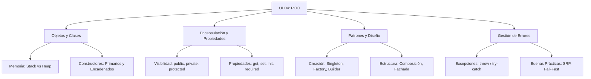

- [13. Resumen y Conclusiones UD04](#13-resumen-y-conclusiones-ud04)
  - [13.1. Resumen de la Unidad](#131-resumen-de-la-unidad)
  - [13.2. Mapa Conceptual Maestro](#132-mapa-conceptual-maestro)
  - [13.3. Tabla Comparativa de Tipos de Objetos](#133-tabla-comparativa-de-tipos-de-objetos)
  - [🚩 Checklist de Supervivencia UD04](#-checklist-de-supervivencia-ud04)

# 13. Resumen y Conclusiones UD04

## 13.1. Resumen de la Unidad
En esta unidad hemos dominado el paradigma de la **Programación Orientada a Objetos**, pasando de simples datos sueltos a entidades con personalidad, estado y comportamiento. Hemos aprendido que:
- Los **Objetos** son el centro del diseño.
- Las **Clases** son los moldes que definen sus reglas.
- La **Encapsulación** es nuestra armadura para proteger los datos.
- Las **Excepciones** son nuestras redes de seguridad.
- Los **Patrones de Diseño** son las soluciones maestras a problemas recurrentes.

## 13.2. Mapa Conceptual Maestro

## 13.3. Tabla Comparativa de Tipos de Objetos

| Característica | Class | Struct | Record |
| :--- | :--- | :--- | :--- |
| **Memoria** | Heap (Referencia) | Stack (Valor) | Heap/Stack |
| **Igualdad** | Identidad (Default) | Por Valor | Por Valor (Automática) |
| **Inmutabilidad** | Opcional | Recomendada | Por defecto (Posicional) |
| **Uso Ideal** | Entidades complejas | Datos pequeños | Modelos de datos / DTO |

## 🚩 Checklist de Supervivencia UD04

- [ ] ¿Entiendo por qué `new` devuelve una referencia y no el objeto en sí?
- [ ] ¿Sé por qué mis atributos deben ser siempre `private` (Ocultación)?
- [ ] ¿Domino la diferencia entre `set`, `init` y `required`?
- [ ] ¿Soy capaz de implementar un patrón Singleton seguro?
- [ ] ¿Entiendo que `ToString()` y `Equals()` vienen de la clase base `object`?
- [ ] ¿Diferencio entre Composición ("tiene un") y Herencia ("es un")?
- [ ] ¿Sé que el orden de los `catch` debe ir de lo más específico a lo más genérico?
- [ ] ¿He aprendido a documentar con XML para que mi código sea profesional?
