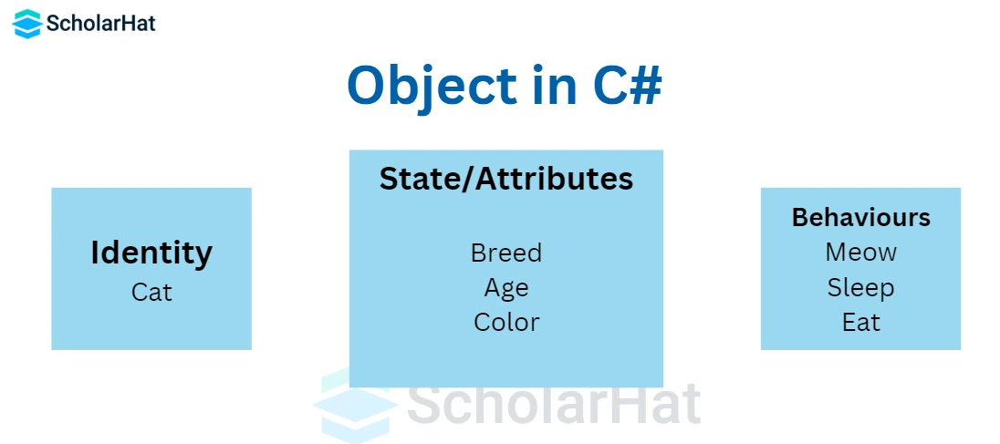
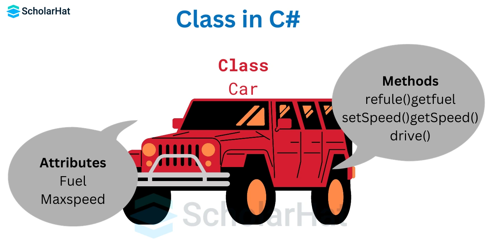
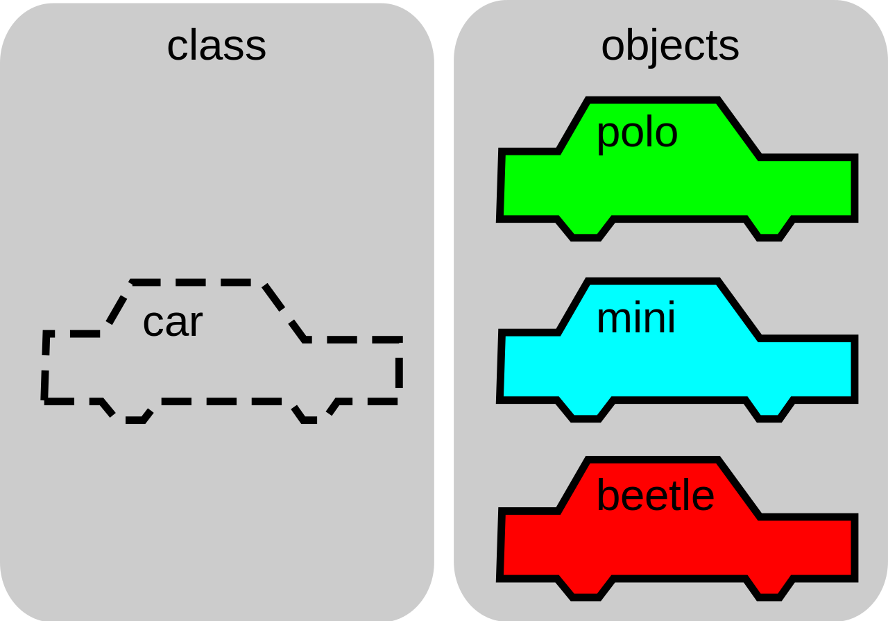
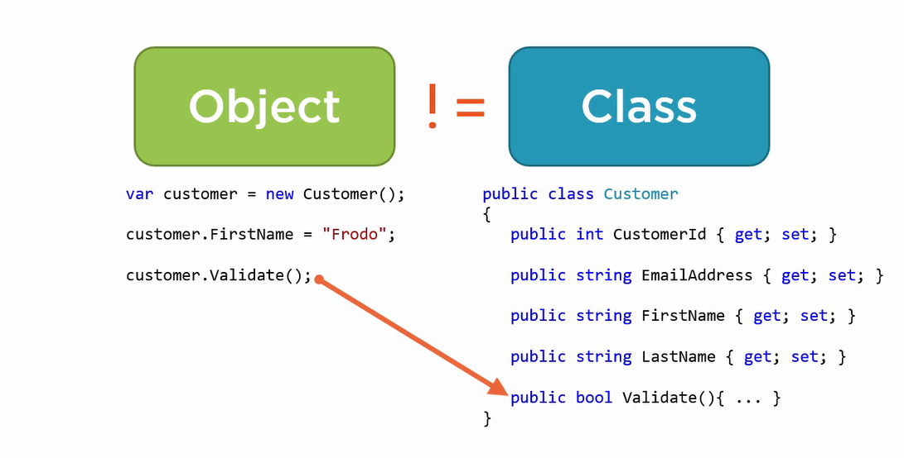
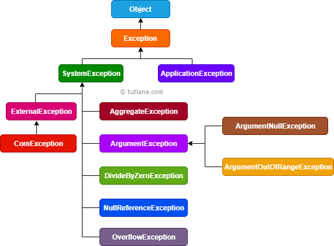

# Programación - 04 Programación Orientada a Objetos

Tema 04 Programación Orientada a Objetos. 1DAW. Curso 2025-2026


- [Programación - 04 Programación Orientada a Objetos](#programación---04-programación-orientada-a-objetos)
  - [Contenido en Youtube](#contenido-en-youtube)
- [1. Programación orientada a objetos: conceptos y principios](#1-programación-orientada-a-objetos-conceptos-y-principios)
  - [1.1 ¿Qué es la programación orientada a objetos?](#11-qué-es-la-programación-orientada-a-objetos)
  - [1.2 Abstracción](#12-abstracción)
  - [1.3 Ocultación](#13-ocultación)
  - [1.4 Encapsulamiento](#14-encapsulamiento)
  - [1.5 Herencia](#15-herencia)
  - [1.6 Polimorfismo](#16-polimorfismo)
  - [1.7 Modularidad](#17-modularidad)
  - [1.8 Recolector de basura (Garbage Collector)](#18-recolector-de-basura-garbage-collector)
  - [1.9 Resumen: importancia de los conceptos en el diseño de software](#19-resumen-importancia-de-los-conceptos-en-el-diseño-de-software)
- [2. Objetos: qué es un objeto y cómo se crea](#2-objetos-qué-es-un-objeto-y-cómo-se-crea)
  - [2.1 Explicación detallada: identidad, estado y comportamiento](#21-explicación-detallada-identidad-estado-y-comportamiento)
    - [Identidad](#identidad)
    - [Estado](#estado)
    - [Comportamiento](#comportamiento)
    - [Interfaz pública](#interfaz-pública)
  - [2.2 Diferencia entre objetos y tipos simples](#22-diferencia-entre-objetos-y-tipos-simples)
  - [2.3 La clase: el mecanismo para crear y tipificar objetos](#23-la-clase-el-mecanismo-para-crear-y-tipificar-objetos)
  - [2.4 ¿Cómo se crea un objeto en C#? ¿Qué pasa con la referencia?](#24-cómo-se-crea-un-objeto-en-c-qué-pasa-con-la-referencia)
  - [2.5 Resumen para el alumno](#25-resumen-para-el-alumno)
- [3. Espacios de nombres y using](#3-espacios-de-nombres-y-using)
  - [3.1 Namespace y file-scoped namespace](#31-namespace-y-file-scoped-namespace)
    - [File-scoped namespace (C# 10+)](#file-scoped-namespace-c-10)
  - [3.2 Using y alias](#32-using-y-alias)
- [4. Clases: definición, atributos, visibilidad y modificadores](#4-clases-definición-atributos-visibilidad-y-modificadores)
  - [4.1 Sintaxis básica de una clase](#41-sintaxis-básica-de-una-clase)
  - [4.2 Estado definido por propiedades](#42-estado-definido-por-propiedades)
  - [4.3 Comportamiento definido por métodos](#43-comportamiento-definido-por-métodos)
  - [4.4 Visibilidad de Atributos/Metodos (privados y públicos): cuándo usar cada uno](#44-visibilidad-de-atributosmetodos-privados-y-públicos-cuándo-usar-cada-uno)
  - [4.5 Modificadores y visibilidad: public, internal, private](#45-modificadores-y-visibilidad-public-internal-private)
  - [4.6 Otros modificadores: sealed, const, readonly, static readonly](#46-otros-modificadores-sealed-const-readonly-static-readonly)
  - [4.7 partial](#47-partial)
  - [4.8 Uso de is y as para comprobación y conversión de tipos](#48-uso-de-is-y-as-para-comprobación-y-conversión-de-tipos)
  - [4.9 Clases por referencia al cambiar el apuntador](#49-clases-por-referencia-al-cambiar-el-apuntador)
  - [4.10 Objetos si son nulos](#410-objetos-si-son-nulos)
- [5. Creación e instanciación de objetos](#5-creación-e-instanciación-de-objetos)
  - [5.1 new y sintaxis básica](#51-new-y-sintaxis-básica)
  - [5.2 Object initializers y uso con init-only](#52-object-initializers-y-uso-con-init-only)
  - [5.3 Target-typed new](#53-target-typed-new)
  - [5.4 Comparativa: constructor vs object initializer](#54-comparativa-constructor-vs-object-initializer)
  - [5.5 Constructores secundarios](#55-constructores-secundarios)
- [6. Referencia this](#6-referencia-this)
  - [6.1 Uso para acceder a miembros de la instancia](#61-uso-para-acceder-a-miembros-de-la-instancia)
  - [6.2 Uso en encadenamiento de constructores](#62-uso-en-encadenamiento-de-constructores)
  - [6.3 Ejemplos prácticos](#63-ejemplos-prácticos)
- [7. Igualdad e identidad](#7-igualdad-e-identidad)
  - [7.1 ReferenceEquals y comportamiento por defecto](#71-referenceequals-y-comportamiento-por-defecto)
  - [7.2 Igualdad por valor vs por referencia](#72-igualdad-por-valor-vs-por-referencia)
  - [7.3 Sobrescribir Equals(object) y GetHashCode()](#73-sobrescribir-equalsobject-y-gethashcode)
- [8. Representación como cadena](#8-representación-como-cadena)
  - [8.1 Override ToString()](#81-override-tostring)
  - [8.2 Interpolación de cadenas ($"...")](#82-interpolación-de-cadenas-)
- [9. Constructores e inicialización](#9-constructores-e-inicialización)
  - [9.1 Propósito de un constructor](#91-propósito-de-un-constructor)
  - [9.2 Constructor por defecto](#92-constructor-por-defecto)
  - [9.3 Constructores parametrizados](#93-constructores-parametrizados)
  - [9.4 Sobrecarga de constructores](#94-sobrecarga-de-constructores)
  - [9.5 Encadenamiento de constructores (this(...))](#95-encadenamiento-de-constructores-this)
  - [9.6 Constructor estático](#96-constructor-estático)
  - [9.7 Constructores privados](#97-constructores-privados)
  - [9.8 Constructor de copia](#98-constructor-de-copia)
  - [9.9 Parámetros opcionales, named arguments y params](#99-parámetros-opcionales-named-arguments-y-params)
  - [9.10 Inicialización de campos readonly](#910-inicialización-de-campos-readonly)
  - [9.11 Constructores en structs y records](#911-constructores-en-structs-y-records)
  - [9.12 Manejo de errores en constructores](#912-manejo-de-errores-en-constructores)
  - [9.13 Constructores primarios  y secundarios](#913-constructores-primarios--y-secundarios)
  - [9.14 Buenas prácticas en constructores](#914-buenas-prácticas-en-constructores)
- [10. Getters y Setters](#10-getters-y-setters)
  - [10.1 Métodos GetX() y SetX()](#101-métodos-getx-y-setx)
  - [10.2 Encapsulación clásica y ejemplos](#102-encapsulación-clásica-y-ejemplos)
  - [10.3 Ventajas de migrar a propiedades](#103-ventajas-de-migrar-a-propiedades)
- [11. Propiedades en C#](#11-propiedades-en-c)
  - [11.1 Propósito y por qué usar propiedades](#111-propósito-y-por-qué-usar-propiedades)
  - [11.2 Auto-implemented properties](#112-auto-implemented-properties)
  - [11.3 Propiedades de solo lectura (get-only)](#113-propiedades-de-solo-lectura-get-only)
  - [11.4 Init-only properties (get; init;)](#114-init-only-properties-get-init)
  - [11.5 Accesibilidad diferenciada en accesores](#115-accesibilidad-diferenciada-en-accesores)
  - [11.6 Expression-bodied properties](#116-expression-bodied-properties)
  - [11.7 Propiedades calculadas (computed properties)](#117-propiedades-calculadas-computed-properties)
  - [11.8 Propiedades con backing field (full properties)](#118-propiedades-con-backing-field-full-properties)
    - [Usos comunes de backing fields](#usos-comunes-de-backing-fields)
  - [11.9 Buenas prácticas y convenciones](#119-buenas-prácticas-y-convenciones)
- [12. Miembros estáticos: métodos y propiedades de clase](#12-miembros-estáticos-métodos-y-propiedades-de-clase)
  - [12.1 Métodos static y propiedades static: sintaxis y uso](#121-métodos-static-y-propiedades-static-sintaxis-y-uso)
  - [12.2 Propiedades estáticas inmutables (static readonly / const)](#122-propiedades-estáticas-inmutables-static-readonly--const)
  - [12.3 Constructor estático y orden de inicialización](#123-constructor-estático-y-orden-de-inicialización)
  - [12.4 Uso práctico: utilidades, contadores, cachés](#124-uso-práctico-utilidades-contadores-cachés)
  - [12.5 Clases estáticas: utilidad y restricciones](#125-clases-estáticas-utilidad-y-restricciones)
- [13. Enums](#13-enums)
  - [13.1 Definición básica y uso](#131-definición-básica-y-uso)
  - [13.2 Asignación de valores específicos](#132-asignación-de-valores-específicos)
  - [13.3 String representation y parsing](#133-string-representation-y-parsing)
  - [13.4 Flags enum y operaciones bit a bit](#134-flags-enum-y-operaciones-bit-a-bit)
- [14. Structs y records](#14-structs-y-records)
  - [14.1 Structs (value types)](#141-structs-value-types)
    - [14.1.1  Pasos por valor vs por referencia](#1411--pasos-por-valor-vs-por-referencia)
  - [14.2 record class](#142-record-class)
  - [14.3 record struct](#143-record-struct)
  - [14.4 Comparativa: class vs struct vs record](#144-comparativa-class-vs-struct-vs-record)
  - [14.5 Tipos anónimos y (Value)Tuples](#145-tipos-anónimos-y-valuetuples)
- [15. Clases anidadas](#15-clases-anidadas)
  - [15.1 Nested classes (estáticas vs de instancia)](#151-nested-classes-estáticas-vs-de-instancia)
  - [15.2 Escenarios de uso](#152-escenarios-de-uso)
- [16. Composición de objetos](#16-composición-de-objetos)
  - [16.1 Contener objetos como campos/propiedades](#161-contener-objetos-como-campospropiedades)
  - [16.2 Ventajas frente a herencia](#162-ventajas-frente-a-herencia)
- [17. Patrones básicos de diseño orientados a objetos](#17-patrones-básicos-de-diseño-orientados-a-objetos)
  - [17.1 Singleton.](#171-singleton)
  - [17.2 Lazy o perezoso](#172-lazy-o-perezoso)
  - [17.2 Métodos fábrica (factory methods / static creators)](#172-métodos-fábrica-factory-methods--static-creators)
  - [17.3 Inicializadores estáticos (static constructors)](#173-inicializadores-estáticos-static-constructors)
  - [17.4 Instanciación y buenas prácticas para records y structs](#174-instanciación-y-buenas-prácticas-para-records-y-structs)
  - [17.5 Fluent pattern / Fluent API](#175-fluent-pattern--fluent-api)
  - [17.6 Builder](#176-builder)
  - [17.7 Fachada (facade)](#177-fachada-facade)
  - [17.8 Composición e inyección de dependencias por constructor](#178-composición-e-inyección-de-dependencias-por-constructor)
- [18. Resume de Modificadores en C#](#18-resume-de-modificadores-en-c)
  - [18.1. Modificadores de Acceso (Visibilidad)](#181-modificadores-de-acceso-visibilidad)
    - [Ejemplo de Restricción de Accesores](#ejemplo-de-restricción-de-accesores)
  - [18.2. Modificadores de Estado](#182-modificadores-de-estado)
    - [**`static`**](#static)
      - [Ejemplo con `static`](#ejemplo-con-static)
    - [**`readonly`**](#readonly)
      - [Ejemplo con `readonly`](#ejemplo-con-readonly)
  - [18.3. Inicialización y Accesorios](#183-inicialización-y-accesorios)
    - [**`get`, `set`, `init`**](#get-set-init)
      - [Ejemplo de `get`, `set`, y `init`](#ejemplo-de-get-set-y-init)
  - [18.4. Obligatoriedad y Lazy Loading](#184-obligatoriedad-y-lazy-loading)
    - [**`required`**](#required)
    - [Diferencia Clave entre `required` e `init`](#diferencia-clave-entre-required-e-init)
      - [Ejemplo con `required`](#ejemplo-con-required)
    - [**`Lazy<T>`**](#lazyt)
      - [Ejemplo con `Lazy<T>`](#ejemplo-con-lazyt)
- [19. Excepciones](#19-excepciones)
  - [19.1 Lanzar excepciones: throw](#191-lanzar-excepciones-throw)
  - [19.2 Manejo: try / catch / finally](#192-manejo-try--catch--finally)
  - [19.3 Excepciones comunes](#193-excepciones-comunes)
  - [19.4 Buenas prácticas](#194-buenas-prácticas)
- [20. Buenas prácticas](#20-buenas-prácticas)
  - [20.1 Nomenclatura y estilo](#201-nomenclatura-y-estilo)
  - [20.2 Mantener clases pequeñas y con responsabilidad única](#202-mantener-clases-pequeñas-y-con-responsabilidad-única)
  - [20   .3 Métodos cortos y enfocados](#20---3-métodos-cortos-y-enfocados)
  - [20.4 Preferir propiedades sobre campos públicos](#204-preferir-propiedades-sobre-campos-públicos)
  - [20.5 Inmutabilidad cuando proceda](#205-inmutabilidad-cuando-proceda)
  - [20.6 Validación temprana](#206-validación-temprana)
  - [20.7 Documentación con XML comments](#207-documentación-con-xml-comments)
  - [20.8 Consideraciones de rendimiento](#208-consideraciones-de-rendimiento)
  - [20.9 Gestión de dependencias y separación de capas](#209-gestión-de-dependencias-y-separación-de-capas)
- [21. Diferencia entre soluciones, proyectos y namespaces en C#](#21-diferencia-entre-soluciones-proyectos-y-namespaces-en-c)
  - [21.1 Solución (.sln)](#211-solución-sln)
  - [21.2 Proyecto (.csproj)](#212-proyecto-csproj)
  - [21.3 Ensamblado](#213-ensamblado)
  - [21.4 Namespace](#214-namespace)
  - [21.5 Relación práctica](#215-relación-práctica)
  - [21.6 Buenas prácticas](#216-buenas-prácticas)
  - [Autor](#autor)
    - [Contacto](#contacto)
  - [Licencia de uso](#licencia-de-uso)

## Contenido en Youtube

- [Podcast](https://youtu.be/JVgLV8QWLSU)
- [Resumen](https://youtu.be/-ZRm4fGY8DY)
- [Encapsulamiento y Propiedades](https://youtu.be/ZdnuCG93CA8)
- [Modificadores](https://youtu.be/T4hA9ULxMQk)
- [Clases vs. Structs vs. Records](https://youtu.be/BTFPmBKA4yI)
- [Lista de Reproducción](https://www.youtube.com/watch?v=wKCdgacEr4Q&list=PLGIH-7eZDbVw6q2AdcAUe2r6YxJYBkfCi)


# 1. Programación orientada a objetos: conceptos y principios

La **programación orientada a objetos (POO)** es una forma de pensar y escribir nuestros programas inspirada en cómo observamos y comprendemos el mundo real. En la vida cotidiana, vemos que todo está formado por “cosas” (objetos) con características y comportamientos propios: una bicicleta, una persona, un control remoto, un libro...  
La POO traslada este modo de pensar al software, ayudándonos a construir programas claros, flexibles y fáciles de ampliar.

## 1.1 ¿Qué es la programación orientada a objetos?

La POO gira en torno al **objeto**. Un objeto es como una “caja” que puede guardar información relevante y ofrece acciones que se pueden realizar sobre él. Lo importante de los objetos es:

- **Estado:** Son los datos que almacena el objeto: por ejemplo, el color de una bicicleta, la edad de una persona.
- **Comportamiento:** Son las operaciones que el objeto puede ejecutar: la bicicleta puede frenar o pedalear, una persona puede caminar o hablar.
- **Identidad:** Cada objeto es único, aunque dos tengan el mismo estado y comportamiento. Por ejemplo, dos hojas de papel iguales: cada una sigue siendo una hoja distinta.

**Ejemplo cotidiano:**  
Imagina un “ordenador” como objeto:
- Estado: sistema operativo, cantidad de memoria RAM, número de serie
- Comportamiento: encenderse, apagar, instalar software
- Identidad: cada ordenador tiene un número de serie propio; aunque dos sean iguales en marca, modelo y memoria, siguen siendo computadoras diferentes.


La POO nos ayuda a organizar nuestros programas como si estuviéramos “construyendo con piezas de Lego”, cada una con su forma, función y nombre propio.

## 1.2 Abstracción

La **abstracción** consiste en fijarnos solo en las características importantes de un objeto, dejando de lado detalles irrelevantes.  
Al diseñar un programa para una biblioteca, por ejemplo, te interesarán el título, el autor y el número de páginas de un libro, pero probablemente no importe el tipo de papel o el color de la portada.

**Ejemplo:**
Piensa en una cafetera. Si vas a modelarla para un programa que gestiona pedidos, sólo necesitas saber si está encendida, cuánta agua tiene y cuánto café queda, no te importa el tornillo que sujeta el filtro.

## 1.3 Ocultación

La **ocultación** significa que cada objeto guarda sus secretos: no puedes ver ni modificar directamente sus datos internos, sólo acceder a lo que te deja su “interfaz” pública.  
Igual que con un mando de televisión: sabes que apretando el botón de encendido, la tele se enciende, pero no sabes cómo funciona por dentro.

**Ejemplo:**
Una caja fuerte solo te deja sacar dinero si conoces la combinación; nadie puede coger dinero rompiendo la caja sin saber su mecanismo.

## 1.4 Encapsulamiento

El **encapsulamiento** junta el estado y los comportamientos de un objeto en un único “contenedor”, ocultando detalles internos y controlando los cambios. De ese modo, si un objeto cambia algo dentro de sí mismo, el resto del programa no se estropea ni se ve afectado.

**Ejemplo:**
Un automóvil decide por sí solo, según su motor y sensores, cuándo encender el ventilador de refrigeración; tú solamente puedes conducir y revisar el panel, pero no gestionas directamente sus variables internas.

## 1.5 Herencia

La **herencia** permite crear objetos que “heredan” características y comportamientos de otros más generales. Es como decir “todos los perros son animales”, así que tienen patas, respiran, pero además los perros pueden ladrar.

**Ejemplo:**
Un “cuaderno” hereda de “libro”, pues ambos tienen páginas, autor y título, pero el cuaderno, además, tiene hojas en blanco y quizá una espiral.

## 1.6 Polimorfismo

El **polimorfismo** da flexibilidad: diferentes objetos pueden responder a la misma orden de maneras distintas.  
Si le pides a tu teléfono y al televisor “encender”, ambos “entienden” la petición, pero cada uno lo hace en su propio estilo.

**Ejemplo:**
Si lanzas una pelota al perro y al robot aspirador, ambos “se mueven” hacia ella, pero el perro corre, el robot gira y avanza; la orden “muévete” se interpreta diferente según el objeto.

## 1.7 Modularidad
La **modularidad** es la práctica de dividir un programa en partes independientes y reutilizables llamadas módulos. Cada módulo encapsula una funcionalidad específica y puede interactuar con otros módulos a través de interfaces bien definidas. Es por ello que los objetos, al ser módulos en sí mismos, facilitan la creación de sistemas modulares.

## 1.8 Recolector de basura (Garbage Collector)
El **recolector de basura** es un sistema automático que gestiona la memoria en lenguajes como C#, Java o Kotlin. Su función es liberar la memoria ocupada por objetos que ya no se usan (no referenciados), evitando fugas de memoria y optimizando el rendimiento del programa.

## 1.9 Resumen: importancia de los conceptos en el diseño de software

La POO ayuda a construir programas muy grandes y complejos al dividir todo en “piezas” bien definidas, cada una responsable de lo suyo.  
Los objetos permiten modelar la realidad, proteger los datos importantes, crear partes reutilizables y asegurar que los cambios no rompan el resto del sistema.  
Al usar abstracción, ocultación, encapsulamiento, herencia y polimorfismo, podemos crear software que es mucho más fácil de entender, mantener y ampliar.

---

# 2. Objetos: qué es un objeto y cómo se crea

Un **objeto** en programación es una representación digital de algo del mundo real o de una idea. Es como un “actor” dentro de tu programa, con personalidad (identidad), datos (estado) y capacidades (comportamiento).



## 2.1 Explicación detallada: identidad, estado y comportamiento

### Identidad

La identidad es lo que hace único a cada objeto, aunque tenga la misma información que otro.  
En la vida real, dos carnets de identidad pueden mostrar la misma foto y datos personales, pero cada uno es una tarjeta física distinta, con su propio número y dueño.  
En programación, la identidad de un objeto se corresponde con la referencia que el ordenador guarda en memoria: cada vez que usas `new` en C#, creas un objeto con una identidad propia, aunque le des los mismos datos que a otro.

**Ejemplo práctico:**  
Imagina dos “bolígrafos” de color azul. Aunque ambos sean iguales y nuevos, uno está en Madrid y otro en Valencia: cada uno es una unidad diferente. En programación, aunque dos objetos tengan el mismo estado, su identidad siempre es distinta porque ocupan diferentes lugares de memoria.

### Estado

El estado de un objeto es la colección de datos que define cómo es ese objeto en un momento dado.  
Por ejemplo:  
- Un alumno: estado = nombre, edad, nota media, curso
- Un semáforo: estado = color actual, si está funcionando o no

El estado puede cambiar a lo largo del tiempo si el objeto tiene comportamientos que lo permiten.

### Comportamiento

El comportamiento es el conjunto de acciones que el objeto puede ejecutar o las respuestas que puede dar. Estas acciones pueden modificar su estado o interactuar con otros objetos.

Por ejemplo:  
- Una puerta: puede abrirse, cerrarse, bloquearse
- Un reloj: puede mostrar la hora, poner la alarma, vibrar

El comportamiento se define en programación como los “métodos” o “funciones” del objeto.

### Interfaz pública
La interfaz pública de un objeto es el conjunto de métodos y propiedades que otros objetos o partes del programa pueden usar para interactuar con él.

---

## 2.2 Diferencia entre objetos y tipos simples

Antes de crear tus propios objetos, observa que tipos como números (`int`, `double`) y letras (`char`, `string`), ya existen desde siempre en los lenguajes de programación.

Por ejemplo:
- Un número como 42 es simplemente un valor; no necesitas rastrear su identidad, sólo su estado.
- Una cadena como “Hola” es un pedazo de texto; puedes consultar su longitud, unirla con otras, pero no tiene una “personalidad”.

El objeto va más allá de esto: puedes definir cómo es, qué puede hacer y cómo debe comportarse en situaciones diferentes.

**Ejemplo:**
Si tienes varios libros, cada uno tendrá un título, un autor y un número de páginas.  
Pero si programas una biblioteca, querrás representar cada libro como objeto para gestionarlo, buscarlo o prestarlo.

---

## 2.3 La clase: el mecanismo para crear y tipificar objetos

En C# (y en muchos lenguajes modernos), **la clase** es la herramienta que te permite definir cómo deben ser tus objetos: qué información guardan y qué acciones pueden realizar.  
La clase es como el molde de una galleta: define el borde, el tamaño y la forma; luego puedes “fabricar” galletas diferentes, pero todas se basan en ese molde.  
A cada objeto creado desde la clase se le llama **instancia**, y a todas juntas, objetos de ese tipo.






**Por qué tipificar objetos:**  
Tipificar significa que cada objeto tiene su propio “tipo” y el compilador puede ayudarte a verificar que uses cada uno correctamente; así evitas confusiones y errores (por ejemplo, no intentas sumar una puerta a una bicicleta).

---

## 2.4 ¿Cómo se crea un objeto en C#? ¿Qué pasa con la referencia?

Cuando quieres utilizar un objeto en C#, lo creas a partir de una clase usando la palabra clave `new`.  
Esto hace tres cosas importantes:

1. **Reserva memoria** para almacenar la información del objeto.
2. **Inicializa el estado inicial** del objeto, según lo que hayas definido en la clase.
3. **Devuelve una referencia**, es decir, una “dirección” en la memoria del programa por donde podrás localizar ese objeto para usarlo en el futuro.

Así, aunque crees dos objetos iguales (mismo estado), cada uno tendrá una referencia diferente y serán instancias distintas (con identidad propia).

**Ejemplo:**
- Primero imaginas cómo debe ser tu “coche” (la clase).
- Luego, cada vez que usas `new`, fabricas un coche concreto (el objeto).
- El ordenador te da una “tarjeta” con la dirección de ese objeto.
- Si cambias la matrícula de un coche, sólo se actualiza ese coche: los demás permanecen igual.

---

## 2.5 Resumen para el alumno

- Un **objeto** es cualquier cosa de tu programa con identidad, estado y comportamiento.
- La **clase** es la receta que usas para crear objetos. Es como el plano de una casa; puedes hacer muchas casas parecidas, pero cada una será única.
- Al **crear** un objeto con `new`, le das vida propia: obtiene una identidad, guarda datos (estado) y puede hacer cosas (comportamiento). La **referencia** te permite acceder a él siempre que lo necesites.

> Entender bien estos conceptos es el primer paso fundamental para dominar la programación orientada a objetos y convertirte en un programador capaz de diseñar software potente y fiable.


---

# 3. Espacios de nombres y using

En programación, especialmente al crear aplicaciones más grandes, necesitamos organizar el código para evitar confusiones y conflictos de nombres. C# nos ofrece los **namespaces** y la instrucción **using** para esta tarea.

## 3.1 Namespace y file-scoped namespace

Un **namespace** (espacio de nombres) es como una carpeta virtual que agrupa tipos relacionados: clases, structs, interfaces, etc. Te permite organizar tus clases y evitar que dos clases con el mismo nombre dentro del proyecto se mezclen o generen errores.

**Ejemplo cotidiano:** Es como tener los documentos de “Matemáticas” y “Historia” en carpetas distintas: ambos pueden tener un archivo llamado “Examen.docx”, pero están separados y no entran en conflicto.

**Ejemplo en C#:**
```csharp
namespace MiAplicacion.Modelos
{
    public class Persona {
        public string Nombre;
    }
}
```
Aquí, la clase `Persona` está en el espacio de nombres `MiAplicacion.Modelos`.

### File-scoped namespace (C# 10+)
Es una nueva forma más concisa de definir el espacio de nombres, útil para archivos individuales:
```csharp
namespace MiAplicacion.Modelos;

public class Producto {
    public string Nombre;
}
```

## 3.2 Using y alias

La instrucción **using** permite importar otros espacios de nombres al archivo, así puedes usar sus clases sin escribir el nombre completo cada vez.

**Ejemplo:**
Si repites muchas veces `MiAplicacion.Modelos.Persona`, puedes usar:
```csharp
using MiAplicacion.Modelos;
// Ahora puedes escribir simplemente: Persona p = new Persona();
```

**Alias:** Puedes dar un nombre corto a un tipo o namespace con `using`.
```csharp
using M = MiAplicacion.Modelos;
// Ahora puedes escribir: M.Persona p = new M.Persona();
```

**Buena práctica:** Organiza tus namespaces para reflejar la estructura lógica del proyecto y usa alias si tienes dos clases con el mismo nombre en distintos namespaces.

---

# 4. Clases: definición, atributos, visibilidad y modificadores

La **clase** es el mecanismo principal para crear tipos de objetos propios. Una clase describe el “molde” para todos los objetos de ese tipo: qué datos guardan (estado) y qué acciones pueden realizar (comportamiento).



## 4.1 Sintaxis básica de una clase

La estructura mínima de una clase en C#, Se suele definir con la palabra clave `class`, seguida del nombre de la clase y un bloque de llaves `{}` que contiene sus miembros (atributos y métodos), la nomenclatura suele ser PascalCase (mayúscula inicial en cada palabra).:
```csharp
public class Gato
{
    public string Nombre;
    public int Edad;
    public void Maullar() {
        Console.WriteLine($"{Nombre} está maullando.");
    }
}
```
Aquí `Nombre` y `Edad` son el estado, `Maullar()` es el comportamiento.

## 4.2 Estado definido por propiedades

Las **propiedades** guardan los datos del objeto. Permiten leer y modificar el estado de forma segura. Usar propiedades preferiblemente, en vez de campos públicos.

**Ejemplo:**
```csharp
public class Pelota
{
    public string Color;
}
```
La propiedad `Color` almacena el estado de cada pelota.

## 4.3 Comportamiento definido por métodos

Los **métodos** de la clase representan acciones o respuestas.

**Ejemplo:**
```csharp
public class Pelota
{
    public void Botar() {
        Console.WriteLine("¡La pelota ha botado!");
    }
}
```

## 4.4 Visibilidad de Atributos/Metodos (privados y públicos): cuándo usar cada uno

Un **atributo/campo** es una variable interna a la clase.  
- **Campos privados** (`private`): solo visibles dentro de la clase. Se usan para almacenar datos internos que no deben ser accesibles desde fuera y se manipulan mediante métodos o propiedades. Se suelen nombrar con un guion bajo inicial (`_miCampo`).
- **Campos públicos** (`public`): visibles desde fuera — ¡evítalos! Mejor expón propiedades con acceso controlado. Se suelen nombrar con mayúscula inicial (`MiCampo`).
- **Métodos privados**: usados para operaciones internas que no deben ser accesibles desde fuera. Se usan para organizar el código dentro de la clase. La nomenclatura suele ser en minúscula inicial (`miMetodo()`).
- **Métodos públicos**: representan la interfaz del objeto, lo que otros objetos pueden hacer con él. Se nombran con mayúscula inicial (`MiMetodo()`).

**Ejemplo:**
```csharp
public class Caja
{
    private string _contenido; // sólo accesible por métodos de Caja
    public String Tipo; // accesible desde fuera

    private int miPeso() {
        return _contenido.Length * 2; // ejemplo simple
    }

    public void Guardar(string item) {
        _contenido = item;
    }
}

var miCaja = new Caja();
miCaja.Tipo = "Madera"; // Ok
// miCaja._contenido = "Juguetes"; // Error: no se puede acceder directamente
miCaja.Guardar("Juguetes"); // Ok, usando método público
miCaja._peso(); // Error: método privado
```

## 4.5 Modificadores y visibilidad: public, internal, private

- **public:** la clase o miembro es accesible desde cualquier sitio, crean la interfaz pública del objeto.
- **internal:** accesible solo desde el mismo proyecto o ensamblado.
- **private:** solo accesible dentro de la clase.
- **protected:** accesible dentro de la clase y sus subclases (herencia).

**Ejemplo de visibilidad:**
```csharp
public class Configuracion
{
    private string clavePrivada = "1234";
    public string NombreUsuario;
    internal int NivelAcceso;
```

## 4.6 Otros modificadores: sealed, const, readonly, static readonly

- **sealed:** no se puede heredar esa clase (evita subclases, lo veremos en el tema siguiente).
- **const:** valor constante en tiempo de compilación; solo para tipos simples.
- **readonly:** valor que sólo puede asignarse una vez en la declaración o el constructor (no se puede modificar después).
- **static readonly:** igual que `readonly` pero compartido por todas las instancias (lo veremos más adelante).
- **required:** (C# 11+) indica que una propiedad debe establecerse al crear el objeto (usando initializers o constructores).

**Ejemplo:**
```csharp
public sealed class Utilidades
{
    public const double PI = 3.1416;
    public static readonly DateTime FechaInicio = DateTime.UtcNow;
    public required string Nombre;
}
```

## 4.7 partial

Permite dividir una clase en varios archivos. Útil cuando se generan partes del código automáticamente o en proyectos grandes. No recomendado en estos momentos para principiantes.

**Ejemplo:**
Archivo 1:
```csharp
public partial class Producto
{
    public string Nombre;
}
```
Archivo 2:
```csharp
public partial class Producto
{
    public int Stock;
}
```
Ambos forman la clase final `Producto`.


## 4.8 Uso de is y as para comprobación y conversión de tipos
El operador `is` verifica si un objeto es de un tipo específico, mientras que `as` intenta convertir un objeto a un tipo determinado, devolviendo `null` si no es posible.

**Ejemplo:**
```csharp
object obj = "Hola Mundo";
if (obj is string mensaje) {    
    Console.WriteLine(mensaje); // Usa 'mensaje' si es string
}
string texto = obj as string;
if (texto != null) {
    Console.WriteLine(texto); // Usa 'texto' si la conversión fue exitosa
}
```

## 4.9 Clases por referencia al cambiar el apuntador
Las clases en C# son tipos por referencia, lo que significa que cuando asignas un objeto a otra variable, ambas variables apuntan al mismo objeto en memoria. Si modificas el objeto a través de una variable, los cambios serán visibles a través de la otra variable.
**Ejemplo:**
```csharp
public class Persona
{
    public string Nombre { get; set; }
}

var persona1 = new Persona { Nombre = "Ana" };
var persona2 = persona1; // persona2 apunta al mismo objeto que persona1
persona2.Nombre = "Luis"; // Cambia el nombre a través de persona2
Console.WriteLine(persona1.Nombre); // Imprime "Luis", ya que ambos apuntan

void TeCambioTodo(ref Persona p)
{
    p = new Persona { Nombre = "Carlos" }; // Cambia la referencia a un nuevo objeto
}

TeCambioTodo(ref persona1);
Console.WriteLine(persona1.Nombre); // Imprime "Carlos", ahora persona1 apunta a un nuevo objeto
```

## 4.10 Objetos si son nulos
En C#, las variables de tipo clase pueden contener una referencia nula (`null`), lo que significa que no apuntan a ningún objeto en memoria. Intentar acceder a miembros de un objeto nulo provoca una excepción `NullReferenceException`.

Por otro lado, al ser referencias no podemos usar .Value y .HasValue como en los tipos valor (structs). Por lo que para acceder a sus miembros debemos asegurarnos de que la referencia no es nula o usar el operador de acceso seguro `?.`.

**Ejemplo:**
```csharp
Persona persona = null;
if (persona != null) {
    Console.WriteLine(persona.Nombre); // Evita NullReferenceException
} else {
    Console.WriteLine("La persona es nula.");
}
```

---

# 5. Creación e instanciación de objetos

Crear (“instanciar”) un objeto es el proceso de obtener una unidad concreta de una clase.

## 5.1 new y sintaxis básica

Cuando usas `new`, le pides al sistema que cree un objeto nuevo de acuerdo a la definición de su clase.

**Ejemplo:**
```csharp
var miGato = new Gato();
miGato.Nombre = "Felix";
miGato.Edad = 3;
```

Cada vez que usas `new`, se crea una referencia nueva en la memoria para ese objeto. Se lamacena en el heap, y la variable (`miGato`) contiene la referencia a esa ubicación.

## 5.2 Object initializers y uso con init-only

Los **initializers** permiten asignar propiedades al momento de crear el objeto.
```csharp
var miLibro = new Libro { Titulo = "1984", Autor = "Orwell" };
```

Si la propiedad es `init`, sólo puede establecerse en el initializer o el constructor: no se podrá modificar después.
```csharp
public class Usuario
{
    public string Nombre;
}

var usuario = new Usuario { Nombre = "Marta" }; // Ok
// usuario.Nombre = "Ana"; // Error: sólo puede fijarse al principio
```

## 5.3 Target-typed new 

Puedes usar la nueva sintaxis con tipos conocidos para acortar el código desde C# 9:
```csharp
Gato miGato = new("Miau", 2); // Si existe un constructor Gato(string, int)
```

## 5.4 Comparativa: constructor vs object initializer

Usa **constructores** cuando necesitas garantizar algún valor sí o sí al crear el objeto, y **initializers** cuando quieres flexibilidad y claridad.

Ejemplo:
```csharp
var gato = new Gato("Felix", 2); // usando constructor, no puedes olvidar la edad
var libro = new Libro { Titulo = "1984", Autor = "Orwell" }; // usando initializer, puedes dejar Autor vacío (no recomendado)
```

## 5.5 Constructores secundarios 
Puedes definir varios constructores en una clase para diferentes formas de crear objetos. Usa `this(...)` para llamar a otro constructor y evitar repetir código. Lo veremos en detalle en el apartado de constructores.
```csharp
public class Coche
{
    public string Marca;
    public string Modelo;
    public int Año;

    // Constructor secundario que usa el principal
    public Coche(string marca, string modelo) : this(marca, modelo, 0) { }

    // Constructor principal
    public Coche(string marca, string modelo, int año) {
        Marca = marca;
        Modelo = modelo;
        Año = año;
    }
}
```

---

# 6. Referencia this

La palabra **this** en C# siempre se refiere al objeto actual, es decir, el mismo sobre el que se está ejecutando el código.  
Ayuda a distinguir entre los atributos del objeto y los parámetros con el mismo nombre. Es importante tenerlo claro para evitar confusiones que al usar this nos referimos a la instancia actual en la que se está ejecutando el método o constructor.

## 6.1 Uso para acceder a miembros de la instancia

**Ejemplo:**
```csharp
public class Punto
{
    private int x;
    public void SetX(int x) {
        this.x = x; // “this.x” es el atributo, “x” es el parámetro
    }
}
```
Aquí, usas `this.x` para asegurarte de referirte al atributo de la instancia.

## 6.2 Uso en encadenamiento de constructores

Puedes usar `this` para llamar a otro constructor de la misma clase, reutilizando lógica.

**Ejemplo:**
```csharp
public class Persona
{
    public string Nombre;
    public int Edad;

    public Persona(string nombre) : this(nombre, 0) { }
    
    public Persona(string nombre, int edad) {
        Nombre = nombre;
        Edad = edad;
    }
}
```

## 6.3 Ejemplos prácticos

En métodos, `this` te permite referenciar la instancia actual para modificar datos o llamar a otros métodos de esa instancia.
Puedes incluso pasar `this` como argumento a otros métodos.

---

# 7. Igualdad e identidad

Cuando trabajas con objetos, es muy importante distinguir entre comparar si son **el mismo objeto** (identidad) o si solo tienen **el mismo estado** (igualdad).

## 7.1 ReferenceEquals y comportamiento por defecto

Una comparación por identidad verifica si dos referencias apuntan al mismo objeto en memoria.

**Ejemplo:**
```csharp
var a = new Libro { Titulo = "1984" };
var b = new Libro { Titulo = "1984" };
Console.WriteLine(object.ReferenceEquals(a, b)); // False: diferente objeto
var c = a;
Console.WriteLine(object.ReferenceEquals(a, c)); // True: misma referencia
```

## 7.2 Igualdad por valor vs por referencia

Por defecto, en C#, la comparación con `==` entre objetos compara la referencia (identidad) salvo que la clase sobrescriba el método `Equals`.

Para comparar el **estado** (contenido):
- Sobreescribe el método `Equals`
- Sobreescribe también `GetHashCode`

## 7.3 Sobrescribir Equals(object) y GetHashCode()

**Ejemplo:**
```csharp
public class Libro
{
    public string Titulo;

    public override bool Equals(object? obj)
    {
        if (obj is Libro otro)
            return Titulo == otro.Titulo;
        return false;
    }
    public override int GetHashCode() => Titulo.GetHashCode();
}
```
Así, dos libros con el mismo título serán iguales por estado, aunque no tengan la misma identidad.

```csharp
var libro1 = new Libro { Titulo = "1984" };
var libro2 = new Libro { Titulo = "1984" };
Console.WriteLine(libro1.Equals(libro2)); // True: mismo estado

if (libro1.Equals(libro2))
    Console.WriteLine("Mismo estado");

if (libro1.GetHashCode() == libro2.GetHashCode())
    Console.WriteLine("Mismo hash code");

if (libro1 == libro2)
    Console.WriteLine("Mismo estado, porque tiene equals");

if (object.ReferenceEquals(libro1, libro2))
    Console.WriteLine("Misma referencia"); // No se cumple
```

Si tenemos varios campos
```csharp
public class Gato {
    public int Edad;
    public bool EsDomestico;
    public string Nombre;
    public string Raza;

    
    public override string ToString() {
        return $"[Gato: {Nombre}, Edad: {Edad}, Raza: {Raza}, Doméstico: {EsDomestico}]";
    }

    public override int GetHashCode() {
        return HashCode.Combine(Nombre, Edad, Raza, EsDomestico);
    }

    public override bool Equals(object obj) {
        if (obj is Gato gato)
            return gato.Nombre == Nombre && gato.Edad == Edad && gato.Raza == Raza && gato.EsDomestico == EsDomestico;
        return false;
    }
}
```

---

# 8. Representación como cadena

Es útil que tus objetos puedan convertirse a texto para mostrar información, depurar o guardar.

## 8.1 Override ToString()

Siempre puedes sobrescribir el método `ToString()` en tu clase para devolver una representación legible.

**Ejemplo:**
```csharp
public class Persona
{
    public string Nombre;
    public int Edad;
    public override string ToString() => $"Persona: {Nombre}, {Edad} años";
}
```
Ahora, si imprimes el objeto, verás ese texto en consola.

## 8.2 Interpolación de cadenas ($"...")

La interpolación (`$`) permite mezclar variables y texto fácilmente:
```csharp
var nombre = "Jose";
var mensaje = $"Hola, {nombre}!";
Console.WriteLine(mensaje); // Imprime: Hola, Jose!
```
Úsalo en ToString() y otros métodos para hacer el código más legible.

---

# 9. Constructores e inicialización

Un **constructor** es el método especial que se llama al crear un objeto, y sirve para establecer su estado inicial. Es como el “ritual de bienvenida” de cada objeto. En el fondo es una función con el mismo nombre que la clase, sin tipo de retorno (ni siquiera `void`), se encarga de reservar memoria y preparar el objeto para su uso.

## 9.1 Propósito de un constructor

Los constructores te obligan a definir el estado inicial de cada objeto, asegurando que todos empiecen bien configurados.

## 9.2 Constructor por defecto

Si no defines ningún constructor, C# crea uno sin parámetros que inicializa los atributos a sus valores por defecto.
**Ejemplo:**
```csharp
public class Animal
{
    public string Nombre; // null por defecto
    public int Edad;      // 0 por defecto
}
var perro = new Animal(); // Usa el constructor por defecto
```

## 9.3 Constructores parametrizados

Permiten pasar información para personalizar el estado al crear el objeto.

**Ejemplo:**
```csharp
public class Animal
{
    public string Nombre;
    public Animal(string nombre) {
        Nombre = nombre;
    }
}
```

## 9.4 Sobrecarga de constructores

Puedes definir varios constructores para permitir distintos modos de inicialización. Con la sobrecarga, cada constructor tiene una firma diferente (número/tipo de parámetros). De esta forma, puedes crear objetos con diferentes niveles de detalle.
Deberemos usar this, para evitar repetir código entre constructores y utlilizar el constructor más completo como base.

**Ejemplo:**
```csharp
public class Animal
{
    public string Nombre;
    public int Edad;

    // Sobrecarga de constructores
    // Si nos pasan solo el nombre, edad será 0 por defecto
    public Animal(string nombre) : this(nombre, 0) { }

    // Constructor principal
    public Animal(string nombre, int edad) {
        Nombre = nombre;
        Edad = edad;
    }
}
```

## 9.5 Encadenamiento de constructores (this(...))

Utiliza `this(...)` para reutilizar lógica y evitar errores, como hemos visto en el ejemplo anterior.
```csharp
public class Libro
{
    public string Titulo;
    public string Autor;
    public int Paginas;

    // Constructor secundario
    public Libro(string titulo) : this(titulo, "Desconocido", 0) { }

    // Constructor principal
    public Libro(string titulo, string autor, int paginas) {
        Titulo = titulo;
        Autor = autor;
        Paginas = paginas;
    }
}

var libro1 = new Libro("1984"); // Autor="Desconocido", Paginas=0
var libro2 = new Libro("1984", "Orwell", 328);
``` 

## 9.6 Constructor estático

Un constructor `static` se ejecuta una sola vez antes de que se use la clase (para inicializar datos compartidos). Lo veremos más adelante en detalle.

**Ejemplo:**
```csharp
public class Configuracion
{
    public static string RutaConfig;
    static Configuracion() {
        RutaConfig = "/etc/config";
    }
}
```

## 9.7 Constructores privados

Sirven para controlar cómo se instancian los objetos, por ejemplo, en patrones singleton o factories. Lo veremos más adelante.
```csharp
public class Singleton
{
    private static Singleton instancia;
    private Singleton() { }
    public static Singleton ObtenerInstancia() {
        if (instancia == null) {
            instancia = new Singleton();
        }
        return instancia;
    }
}
```

## 9.8 Constructor de copia

Crea una nueva instancia copiando el estado de otro objeto (útil para duplicar objetos sin compartir referencia).
```csharp
public class Punto
{
    public int X;
    public int Y;

    // Constructor de copia
    public Punto(Punto otro) {
        X = otro.X;
        Y = otro.Y;
    }
}

var p1 = new Punto { X = 5, Y = 10 };
var p2 = new Punto(p1); // p2 es una copia de p1    
```

## 9.9 Parámetros opcionales, named arguments y params

Puedes facilitar distintos modos de uso con parámetros por defecto y argumentos con nombre, como vimos en funciones.
```csharp
public class Rectangulo
{
    public Rectangulo(int alto = 10, int ancho = 5) { ... }
}
var r1 = new Rectangulo(); // usa los valores por defecto
var r2 = new Rectangulo(ancho: 15); // alto=10, ancho=15
```

## 9.10 Inicialización de campos readonly

Los campos `readonly` pueden fijarse solo una vez (en la declaración o en el constructor), ayudando a crear objetos inmutables, de esta manera que no se puedan modificar después de ser creados.
```csharp
public class Circulo
{
    public readonly double Radio;
    public Circulo(double radio) {
        Radio = radio;
    }
}

var c = new Circulo(5.0);
// c.Radio = 10.0; // Error: no se puede modificar después del constructor
```

## 9.11 Constructores en structs y records

- **Structs:** Debes inicializar todos los campos en el constructor; hay uno por defecto si no defines ninguno. Lo veremos en detalle en el apartado de structs, aunque mucho lo hemos adelantado ya en el temaanterior.
- **Records:** Suelen tener constructores posicionales (`record Persona(string Nombre, int Edad)`), y soportan inicialización con `with` para crear copias modificadas. Lo veremos en detalle en el apartado de records.

## 9.12 Manejo de errores en constructores
Lanza excepciones si los argumentos son inválidos para asegurar objetos consistentes desde el principio.
**Ejemplo:**
```csharp
public class CuentaBancaria
{
    public decimal Saldo;

    public CuentaBancaria(decimal saldoInicial) {
        if (saldoInicial < 0)
            throw new ArgumentException("El saldo inicial no puede ser negativo.");
        Saldo = saldoInicial;
    }
}

var cuenta = new CuentaBancaria(-100); // Lanza excepción
```

## 9.13 Constructores primarios  y secundarios
Los **constructores primarios** permiten definir parámetros directamente en la declaración de la clase, simplificando la sintaxis para clases simples. Esta característica está disponible a partir de C# 12.
```csharp
public class Persona(string nombre, int edad)
{
    public string Nombre { get; } = nombre;
    public int Edad { get; } = edad;
}

var p = new Persona("Ana", 30);
```

Esta forma es ideal para simplificar la inyección de dependencias con campos `readonly`. 
```csharp
public class ServicioCorreo(string servidorSmtp, int puerto)
{
    private readonly string _servidorSmtp = servidorSmtp;
    private readonly int _puerto = puerto;

    public void EnviarCorreo(string destinatario, string asunto, string cuerpo) {
        // Lógica para enviar correo usando _servidorSmtp y _puerto
    }
}
```

Los constructores secundarios pueden seguir definiéndose como antes, y pueden llamar al constructor primario usando `: this(...)` (igual que con los constructores normales y hemos visto en ejemplos anteriores).

```csharp
public class Producto(string nombre, decimal precio)
{
    public string Nombre { get; } = nombre;
    public decimal Precio { get; } = precio;

    // Constructor secundario que asigna un precio por defecto
    public Producto(string nombre) : this(nombre, 0.0m) { }
}
```

## 9.14 Buenas prácticas en constructores

- Hazlos simples; delega procesos largos a métodos o factories.
- Mantén siempre los invariantes del objeto.
- Usa excepciones para validar argumentos.
- Prefiere constructores parametrizados sobre el uso excesivo de setters después de crear el objeto.
- No tengas lógica pesada dentro de los constructores.
- Usa parámetros con valores por defecto para evitar múltiples sobrecargas innecesarias.
- Siempre que puedas, para una sintaxis más limpia, usa initializers o constructores primarios (C# 12+) en lugar de múltiples constructores secundarios.

---

# 10. Getters y Setters

Los **getters** y **setters** son métodos especiales que permiten acceder y modificar los atributos privados de una clase de forma controlada. Antes de que C# introdujera las propiedades. Recuerda que por principio de ocultación, los atributos deben ser privados y no accesibles directamente desde fuera de la clase. Esto ayuda a proteger el estado interno del objeto y a mantener su integridad (encapsulamiento).

## 10.1 Métodos GetX() y SetX()

**Ejemplo:**
```csharp
public class Perro
{
    private int edad;
    public int GetEdad() => edad;
    public void SetEdad(int valor) => edad = valor;
}
```

## 10.2 Encapsulación clásica y ejemplos

Permite controlar cómo se accede y cambia el estado, por ejemplo, añadiendo validaciones.

**Ejemplo con validación:**
```csharp
public class Persona
{
    private int edad;
    public int GetEdad() => edad;
    public void SetEdad(int valor) {
        if (valor < 0) throw new ArgumentException("La edad no puede ser negativa");
        edad = valor;
    }
}
```

## 10.3 Ventajas de migrar a propiedades

Las **propiedades** (`get`/`set`) de C# son más limpias y potentes, permiten utilizar sintaxis de atributo pero con la seguridad y control de los métodos.

---

# 11. Propiedades en C#

Las **propiedades** son una de las características más útiles de C#, ya que combinan la sencillez de los campos y la seguridad de los métodos.

## 11.1 Propósito y por qué usar propiedades

Permiten exponer información interna del objeto de forma controlada, pudiendo añadir validaciones, lógica, notificaciones, etc. Con ellos intentamos crear una interfaz clara y segura para interactuar con el estado del objeto.

## 11.2 Auto-implemented properties

Propiedades que el compilador gestiona automáticamente, ideales para objetos de datos.

**Ejemplo:**
```csharp
public class Producto
{
    public string Nombre { get; set; } // Si no se pone get y set es de ambos tipos
    public decimal Precio { get; set; }
}
```
Puedes inicializar el valor por defecto también:
```csharp
public string Descripcion { get; set; } = "Sin descripción";
```

## 11.3 Propiedades de solo lectura (get-only)

No tienen `set`, o sólo lo tienen privado/interno — el usuario no puede modificarlas después de crear el objeto.
**Ejemplo:**
```csharp
public class Circulo
{
    public double Radio { get; }
    public double Area => Math.PI * Radio * Radio;

    public Circulo(double radio) {
        Radio = radio;
    }
}
```

## 11.4 Init-only properties (get; init;)

Solo pueden asignarse durante inicialización (constructor o `new { ... }`). Aumentan la inmutabilidad y seguridad.
```csharp
public class Usuario
{
    public string Nombre { get; init; }
    public int Edad { get; init; }
}

var usuario = new Usuario { Nombre = "Ana", Edad = 25 };
// usuario.Edad = 30; // Error: no se puede modificar después de la inicial
```

## 11.5 Accesibilidad diferenciada en accesores

Puedes decidir quién puede leer o escribir cada propiedad:
```csharp
public string Clave { get; private set; }
```

## 11.6 Expression-bodied properties

Sintaxis corta para propiedades calculadas, son propiedades que devuelven un valor basado en otros atributos.:
```csharp
public int Area => Alto * Ancho;
```

## 11.7 Propiedades calculadas (computed properties)

Permiten devolver, por ejemplo, el nombre completo a partir de otras propiedades:
```csharp
public string NombreCompleto => $"{Nombre} {Apellidos}";
```

## 11.8 Propiedades con backing field (full properties)

Cuando necesitas lógica, validación o transformar datos antes de guardarlos. Son fundamentales para mantener la integridad del estado del objeto.

**Ejemplo:**
```csharp
private int _edad;
public int Edad {
    get => _edad;
    set {
        if (value < 0) throw new ArgumentException("La edad no puede ser negativa");
        _edad = value;
    }
}
```

Desde C# 14 puedes usar contextualmente field para referirte al backing field sin declararlo explícitamente:
```csharp
class Empleado
{
    public decimal Salario {
        get;
        set => field = (value >= 0)
            ? value
            : throw new ArgumentOutOfRangeException(nameof(value), "El salario no puede ser negativo.");
    }
}
```

### Usos comunes de backing fields

- **Validación en set:** Comprueba y lanza excepción si el valor no es válido.
- **Encapsulación de invariantes:** Asegura que siempre se cumplen las reglas del objeto.
- **Lazy initialization:** Inicializa sólo cuando se necesita (ideal para objetos costosos).
- **Normalización de entradas:** Ajusta valores antes de almacenarlos (ejemplo: convertir nombres a mayúsculas).
- **Notificación de cambios:** Útil en interfaces; puedes avisar si una propiedad cambia (INotifyPropertyChanged).

**Ejemplos con backing fields C# 14 +:**
```csharp
public class Producto
{
    string Nombre {
        get;
        set => field = value?.Trim() ?? throw new ArgumentNullException(nameof(value), "El nombre no puede ser nulo.");
    }
    decimal Precio {
        get;
        set => field = (value >= 0)
            ? value
            : throw new ArgumentOutOfRangeException(nameof(value), "El precio no puede ser negativo.");
    }
}
```

## 11.9 Buenas prácticas y convenciones

- Usa PascalCase para los nombres.
- Prefiere propiedades auto-implementadas salvo que necesites lógica adicional.
- Usa backing fields si hay validación, transformación o control especial.

---

# 12. Miembros estáticos: métodos y propiedades de clase

Los **miembros estáticos** pertenecen a la clase, no a una instancia concreta. ¿Qué quiere decir esto? Significa que puedes acceder a ellos sin crear un objeto de esa clase. Es la propia clase la que se encarga de contenerlos y gestionarlos. **Son elementos compartidos** entre todas las instancias de la clase (objetos).

Son útiles para datos o comportamientos compartidos por todas las instancias, o para utilidades generales.

## 12.1 Métodos static y propiedades static: sintaxis y uso

**Ejemplo:**
```csharp
public class Matematica
{
    public static double Sumar(double a, double b) => a + b;
}

// Uso:
double resultado = Matematica.Sumar(3, 5);
```

## 12.2 Propiedades estáticas inmutables (static readonly / const)

- **const:** valor fijo en tiempo de compilación.
- **static readonly:** valor fijo en tiempo de ejecución, se puede inicializar en el constructor estático.

## 12.3 Constructor estático y orden de inicialización

Se usa para inicializar datos compartidos de la clase antes de que se use cualquier miembro.
```csharp
public class Configuracion
{
    public static readonly string RutaConfig;

    static Configuracion() {
        RutaConfig = "/etc/config";
    }
}

var ruta = Configuracion.RutaConfig;
Console.WriteLine(ruta); // Imprime: /etc/config
```

## 12.4 Uso práctico: utilidades, contadores, cachés

Por ejemplo, contar cuántos objetos se han creado:
```csharp
public class Ejemplo
{
    public static int ContadorInstancias { get; private set; }
    public Ejemplo() => ContadorInstancias++;
}


var e1 = new Ejemplo();
var e2 = new Ejemplo();
Console.WriteLine(Ejemplo.ContadorInstancias); // Imprime: 2

```

## 12.5 Clases estáticas: utilidad y restricciones

Una clase estática sólo puede tener miembros estáticos y no puede instanciarse. Útil para métodos de utilidad.
```csharp
public static class Utilidades
{
    public static int Max(int a, int b) => (a > b) ? a : b;
}

var maximo = Utilidades.Max(10, 20);
```

---

# 13. Enums

Los **enums** te permiten definir un conjunto de valores posibles para un tipo. Lo hemos visto en  el tema anterior. Recuerda que son tipos por valor y se usan para representar opciones limitadas y conocidas y en el fondo son números enteros bajo el capó con nombres legibles.

## 13.1 Definición básica y uso

**Ejemplo:**
```csharp
public enum Color { Rojo, Verde, Azul }
Color miColor = Color.Azul;
```

## 13.2 Asignación de valores específicos
Puedes asignar valores específicos a cada miembro del enum, si no llevan asignación explícita, empiezan en 0 y aumentan en 1. Si hay asignaciones explícitas, los siguientes continuarán desde el último valor asignado.
```csharp
public enum DiaSemana { Lunes = 1, Martes = 2, Miercoles = 3, Jueves = 4, Viernes = 5, Sabado = 6, Domingo = 7 }
DiaSemana hoy = DiaSemana.Miercoles;
// Puedes hacer el casting explícito si es necesario
int valor = (int)hoy; // valor será 3
// Se puede asignar un valor específico
DiaSemana dia = (DiaSemana)5; // dia será DiaSemana.Viernes
```

## 13.3 String representation y parsing
Puedes convertir enums a cadenas y viceversa usando `ToString()` y `Enum.Parse` o `Enum.TryParse`.
```csharp
Color color = Color.Rojo;
string nombreColor = color.ToString(); // "Rojo"
Color color2 = (Color)Enum.Parse(typeof(Color), "Verde");
```

## 13.4 Flags enum y operaciones bit a bit

Puedes combinar valores para indicar varias opciones con `[Flags]`, esto es útil para permisos, configuraciones, etc.
```csharp
[Flags]
public enum Permiso { Leer = 1, Escribir = 2, Ejecutar = 4 }
Permiso p = Permiso.Leer | Permiso.Escribir;
```
---

# 14. Structs y records

Los **structs** y **records** son formas alternativas de definir objetos en C#, con diferencias importantes respecto a las clases y por lo tanto a lo que significan a nivel de diseño, semántica y uso.

## 14.1 Structs (value types)

- Son tipos por **valor**: copiar un struct crea una copia independiente.
- Usarlos para datos pequeños e inmutables. Generalmente se usan para representar valores simples como puntos, colores, coordenadas, etc. Es decir, para representar datos que tienen un significado propio y no una identidad única (estados independientes).
- No pueden tener herencia (no pueden derivar de otras clases o structs, pero sí pueden implementar interfaces).
- Se almacenan en la pila (stack) o inline en otros objetos, lo que puede mejorar el rendimiento en ciertos escenarios.
- Deben inicializar todos sus campos en el constructor.
- Si pueden tener comportamiento, es decir, métodos y propiedades (además de backing fields). Pero se recomienda que sean simples y enfocados en representar datos.

**Ejemplo:**
```csharp
public struct Punto
{
    public int X { get; } // propiedad de solo lectura
    public int Y { get; } // propiedad de solo lectura
    public Punto(int x, int y) => (X, Y) = (x, y);
}
```

### 14.1.1  Pasos por valor vs por referencia
- Al pasar un struct a un método, se pasa una copia (por valor).
- Al pasar una clase, se pasa una referencia al objeto (por referencia).
- Esto afecta el comportamiento y la eficiencia.
- Sin embargo, puedes usar `ref` o `out` para pasar structs por referencia si es necesario.

```csharp
public void ModificarPunto(ref Punto p) {   
    p = new Punto(p.X + 1, p.Y + 1);
}
```

## 14.2 record class

- Son tipos por **referencia** con igualdad por **valor**.
- Ideales para modelos de datos inmutables (DTO).
- Soportan `with` para crear copias modificadas fácilmente.
- Generan automáticamente `Equals`, `GetHashCode` y `ToString` basados en las propiedades.

**Ejemplo:**
```csharp
public record Persona(string Nombre, int Edad);
var p1 = new Persona("Juan", 30);
var p2 = p1 with { Edad = 31 }; // copia modificada
Console.WriteLine(p1 == p2); // False: diferentes edades
Console.WriteLine(p1); // Imprime: Persona { Nombre = Juan, Edad = 30 }
```

## 14.3 record struct

- Como los records, pero son tipos por **valor**.
- Soportan `with` para crear copias modificadas.
- Generan automáticamente `Equals`, `GetHashCode` y `ToString` basados en las propiedades.
- Recomendada para datos pequeños, inmutables y que necesiten igualdad por valor.

## 14.4 Comparativa: class vs struct vs record

- **Class:** identidad, referencia (heap), usualmente mutable. Estado y Comportamiento que el programador necesite.
- **Struct:** valor (stack), independencia, mejor inmutables. Sobre todo para Estados pequeños y simples.
- **Record:** igual que class/struct pero con igualdad y copia automática. Ideales para modelos de datos inmutables.

**¿Cuándo usar cada uno?**  
- Si tu objeto representa una entidad con vida propia (usuario, factura): class.
- Si es un valor pequeño e inmutable (punto, coordenada): struct.
- Si necesitas comparar por valor y hacer copias fáciles: record class o record struct.

## 14.5 Tipos anónimos y (Value)Tuples

Permiten crear objetos “de paso” para almacenar datos juntos:

**Ejemplo:**  
```csharp
var anon = new { Nombre = "Juan", Edad = 30 };
Console.WriteLine(anon.Nombre); // "Juan"
var tupla = (Nombre: "Ana", Edad: 25);
Console.WriteLine(tupla.Edad); // 25
```

---

# 15. Clases anidadas

Las **clases anidadas** son clases definidas dentro de otras clases. Útiles para agrupar tipos relacionados.

## 15.1 Nested classes (estáticas vs de instancia)

Una clase interna puede acceder a miembros de la clase externa si son accesibles.

**Ejemplo:**
```csharp
public class Persona
{
    public class Documento
    {
        public string DNI { get; set; }
    }
}
var doc = new Persona.Documento();
```

## 15.2 Escenarios de uso

Úsalas para agrupar tipos que sólo tienen sentido dentro de otro, o para evitar crear archivos extra. Especialmente útil en patrones como el Builder.

---

# 16. Composición de objetos

La **composición** es un patrón muy útil: consiste en construir objetos que contienen otros objetos como parte de su estado.

## 16.1 Contener objetos como campos/propiedades

**Ejemplo:**
```csharp
public class Coche
{
    public Motor Motor { get; }
    public Coche(Motor motor) => Motor = motor;
}
```
Aquí, la clase Coche se compone de un Motor. Esto permite reutilizar la clase Motor en otros contextos y facilita el mantenimiento. Además deja claro que un Coche “tiene un” Motor. Por lo tanto, la composición representa una relación de “tiene un” o “es parte de” y Coche tiene una dependencia hacia Motor. Por lo tanto debemos "inyectar" el Motor en el constructor de Coche.

```csharp
var motorV8 = new Motor("V8");
var miCoche = new Coche(motorV8);
```

## 16.2 Ventajas frente a herencia
Lo veremos en el tema siguiente, pero ten en cuenta:

- Más flexible.
- Menos acoplamiento.
- Más fácil de extender y testear.

---

# 17. Patrones básicos de diseño orientados a objetos

Aquí se presentan patrones fundamentales para la construcción de objetos y el diseño de sistemas.

## 17.1 Singleton.

Asegura que solo haya una instancia de una clase en todo el programa.

**Ejemplo:**
```csharp
public sealed class Config
{
    private static Config instancia = null;
    private Config() { }
    public static Config ObtenerInstancia() {
        if (instancia == null) {
            instancia = new Config();
        }
        return instancia;
    }
}
```

Otra forma más sencilla y segura en C# es usar un campo estático readonly:
```csharp
public sealed class Config
{
    private static readonly Config instancia = new Config();
    private Config() { }
    public static Config ObtenerInstancia() => instancia;
}
```

## 17.2 Lazy o perezoso
Se usa para retrasar la creación de un objeto hasta que se necesite, optimizando recursos, especialmente útil en singletons, o cuando la creación del objeto es costosa ahorrando tiempo y memoria si no se usa.
- Pros: Ahorra recursos, mejora el rendimiento inicial.
- Contras: Añade complejidad, puede complicar el manejo de errores. Puede ser más lento la primera vez que se accede.

```csharp
public class RecursoCostoso
{
    private static readonly Lazy<RecursoCostoso> instancia =
        new Lazy<RecursoCostoso>(() => new RecursoCostoso());

    private RecursoCostoso() { }

    public static RecursoCostoso Instancia => instancia.Value;
}
```

## 17.2 Métodos fábrica (factory methods / static creators)

Permiten encapsular la lógica de creación de objetos. Con ellos puedes controlar cómo se crean los objetos, aplicar validaciones, si tenemos un enum podemos devolver diferentes tipos de objetos según el valor, etc.

**Ejemplo:**
```csharp
public class Usuario
{
    public string Nombre { get; }
    private Usuario(string nombre) => Nombre = nombre;
    public static Usuario Crear(string nombre) => new Usuario(nombre);
}
```

## 17.3 Inicializadores estáticos (static constructors)

Se usan para inicializar datos compartidos de la clase antes de que se use cualquier miembro.
```csharp
public class Configuracion
{
    public static readonly string RutaConfig;

    static Configuracion() {
        RutaConfig = "/etc/config";
    }
}
var ruta = Configuracion.RutaConfig;
Console.WriteLine(ruta); // Imprime: /etc/config
```

## 17.4 Instanciación y buenas prácticas para records y structs

Prefiere inmutabilidad, inicializa todo al crear el objeto, evita valores nulos.
**Ejemplo:**
```csharp
public record Persona(string Nombre, int Edad);
var p = new Persona("Juan", 30);
var p2 = p with { Edad = 31 }; // copia modificada
```

## 17.5 Fluent pattern / Fluent API

Permite encadenar métodos para configurar objetos de forma fluida para ello debemos devolver this en los métodos de configuración.
**Ejemplo:**
```csharp
public class Consulta
{
    private string tabla = "";
    private string condicion = "";
    public Consulta From(string tabla)
    {
        this.tabla = tabla;
        return this;
    }
    public Consulta Where(string condicion)
    {
        this.condicion = condicion;
        return this;
    }
    public string Build()
    {
        return $"SELECT * FROM {tabla} WHERE {condicion}";
    }
}

var consulta = new Consulta()
    .From("Usuarios")
    .Where("Edad > 18")
    .Build();

Console.WriteLine(consulta); // Imprime: SELECT * FROM Usuarios WHERE Edad > 18
```

## 17.6 Builder

El **Builder** ayuda a construir objetos complejos paso a paso. De esta forma puedes crear objetos con muchas configuraciones sin necesidad de tener constructores con muchos parámetros o usar parámetros opcionales.

**Ejemplo básico:**
```csharp
public class PersonaBuilder
{
    private string nombre = "";
    private int edad = 0;
    public PersonaBuilder SetNombre(string nombre)
    {
        this.nombre = nombre;
        return this;
    }
    public PersonaBuilder SetEdad(int edad)
    {
        this.edad = edad;
        return this;
    }
    public Persona Build()
    {
        return new Persona(nombre, edad);
    }
}

var persona = new PersonaBuilder().SetNombre("Ana").SetEdad(22).Build();
Console.WriteLine(persona); // Imprime: Persona { Nombre = Ana, Edad = 22 }
var persona2 = new PersonaBuilder().SetEdad(30).Build();
Console.WriteLine(persona2); // Imprime: Persona { Nombre = , Edad =
```


## 17.7 Fachada (facade)

Agrupa múltiples operaciones complejas en una interfaz simple. De esta manera encapsula la complejidad y facilita el uso de subsistemas.

**Ejemplo:**
```csharp
public class Casa
{
    private readonly Puerta puerta = new();
    private readonly Ventana ventana = new();
    public void AbrirTodo()
    {
        puerta.Abrir();
        ventana.Abrir();
    }
    public void CerrarTodo()
    {
        puerta.Cerrar();
        ventana.Cerrar();
    }
}
```

## 17.8 Composición e inyección de dependencias por constructor

La composición facilita la inyección de dependencias: pasa los objetos que tu clase necesita a través del constructor.  
Así el código es más flexible y fácil de cambiar o testear.

**Ejemplo:**
```csharp
class Motor
{
    public string Tipo { get; }
    public Motor(string tipo) => Tipo = tipo;
    public void Encender() => Console.WriteLine("Motor encendido");
}

class Coche
{
    private readonly Motor motor;
    public Coche(Motor motor) => this.motor = motor;
    public void Arrancar() => motor.Encender();
}

var motorV8 = new Motor("V8");
var miCoche = new Coche(motorV8);
miCoche.Arrancar(); // Imprime: Motor encendido
```

---
# 18. Resume de Modificadores en C#

Las **propiedades** son miembros de una clase o *struct* que proporcionan un mecanismo flexible para acceder a campos privados. Exponen el dato a través de bloques de código llamados **accesores** (`get`, `set`, `init`), permitiendo la lógica de validación, cálculo o acceso diferido.

## 18.1. Modificadores de Acceso (Visibilidad)

Estos modificadores se usan para controlar qué partes del código pueden interactuar con la propiedad o con sus accesores individuales.

| Modificador     | Alcance                                                      | Descripción                                                                            | Ejemplo                                          |
| :-------------- | :----------------------------------------------------------- | :------------------------------------------------------------------------------------- | :----------------------------------------------- |
| **`public`**    | **Todo** el código.                                          | Acceso sin restricciones desde cualquier parte del programa.                           | `public string Nombre { get; set; }`             |
| **`private`**   | **Solo** la clase o *struct* contenedora.                    | Limita el acceso únicamente a los métodos y miembros de la clase donde está declarada. | `private decimal CostoInterno { get; set; }`     |
| **`internal`**  | **Solo** el ensamblado (proyecto) actual.                    | El acceso está limitado a los tipos definidos dentro del mismo ensamblado.             | `internal bool EstaEnOferta { get; set; }`       |
| **`protected`** | La clase contenedora **y** las clases derivadas (herederas). | El acceso se permite en la clase base y en cualquier clase que herede de ella.         | `protected DateTime FechaCreacion { get; set; }` |

### Ejemplo de Restricción de Accesores

Se puede restringir la accesibilidad de un accesor (`set` o `get`) siempre que sea **más restrictivo** que el modificador de la propiedad principal:

```csharp
public class Producto
{
    // La propiedad es pública para leer, pero solo la clase 'Producto' puede modificarla.
    public decimal Precio { get; private set; } 

    // La propiedad es interna para leer, pero solo la clase 'Producto' (y sus herederas) 
    // pueden establecerla (protected set es más restrictivo que internal get).
    internal string Codigo { get; protected set; }
    
    public Producto(string codigo, decimal precio)
    {
        // El 'private set' y 'protected set' son accesibles desde aquí (dentro de la clase).
        Codigo = codigo; 
        Precio = precio;
    }
}
```

-----

## 18.2. Modificadores de Estado

### **`static`**

| Característica     | Descripción                                                                         |
| :----------------- | :---------------------------------------------------------------------------------- |
| **Propósito**      | La propiedad pertenece a la **clase**, no a una instancia individual (objeto).      |
| **Comportamiento** | Hay una única copia de esta propiedad compartida por todos los objetos de la clase. |
| **Uso Común**      | Contadores, constantes o *logs* de actividad de la clase.                           |

#### Ejemplo con `static`

```csharp
public class Pedido
{
    // Contador global para todos los pedidos
    public static int TotalPedidos { get; private set; } = 0;

    public Pedido()
    {
        TotalPedidos++; // Se incrementa cada vez que se crea un nuevo pedido
    }
}

// Uso:
// Acceso directo a través de la clase, no de una instancia
Console.WriteLine(Pedido.TotalPedidos); // 0
var p1 = new Pedido(); 
var p2 = new Pedido();
Console.WriteLine(Pedido.TotalPedidos); // 2
```

### **`readonly`**

| Característica     | Descripción                                                                                   |
| :----------------- | :-------------------------------------------------------------------------------------------- |
| **Propósito**      | Garantiza que un **campo de respaldo** (o un campo en general) solo se pueda asignar una vez. |
| **Comportamiento** | Solo se puede inicializar en: 1) La declaración o 2) El constructor.                          |
| **Uso Común**      | Inmutabilidad y seguridad de que un valor no cambiará después de la construcción.             |

#### Ejemplo con `readonly`

```csharp
public class Config
{
    // Campo de respaldo 'readonly'
    private readonly string _nombreServidor; 

    // Propiedad de solo lectura que expone el campo
    public string NombreServidor => _nombreServidor; // Solo tiene 'get'

    public Config(string nombre)
    {
        // ÚNICO lugar fuera de la declaración donde se puede asignar:
        _nombreServidor = nombre; 
    }
    
    // public void IntentarCambiar() { _nombreServidor = "otro"; } // ERROR: El campo es readonly.
}
```

-----

## 18.3. Inicialización y Accesorios

### **`get`, `set`, `init`**

Estos son los **accesores** que definen cómo se lee (`get`) y cómo se escribe (`set`/`init`) el valor de la propiedad.

| Accesor    | Propósito                                     | Comportamiento                                                                                                      |
| :--------- | :-------------------------------------------- | :------------------------------------------------------------------------------------------------------------------ |
| **`get`**  | Lectura de valor.                             | Contiene la lógica para devolver el valor de la propiedad.                                                          |
| **`set`**  | Escritura de valor (**mutable**).             | Permite cambiar el valor en **cualquier momento** después de la creación del objeto.                                |
| **`init`** | Escritura de valor (**solo inicialización**). | Permite cambiar el valor **solo** durante la inicialización del objeto (C\# 9). Después, se vuelve de solo lectura. |

#### Ejemplo de `get`, `set`, y `init`

```csharp
public class Empleado
{
    // Propiedad con 'set': Se puede modificar en cualquier momento
    public string Puesto { get; set; } = "Junior"; 

    // Propiedad con 'init': Solo se puede establecer al crear el objeto
    public int IdEmpleado { get; init; } 
    
    // Propiedad calculada (solo 'get')
    public string NombreCompleto { get; } 
    
    public Empleado(string nombreCompleto)
    {
        NombreCompleto = nombreCompleto; // Asignación válida dentro del constructor
    }
}

// Uso:
var e = new Empleado("Ana García") 
{ 
    IdEmpleado = 101 // Válido: Inicializador de objeto
};

e.Puesto = "Senior"; // Válido: Tiene 'set'
// e.IdEmpleado = 102; // ERROR: Es 'init-only', no se puede reasignar fuera de la inicialización
```

-----

## 18.4. Obligatoriedad y Lazy Loading

### **`required`**

| Característica     | Descripción                                                                                                                                  |
| :----------------- | :------------------------------------------------------------------------------------------------------------------------------------------- |
| **Propósito**      | Obligar al código cliente a inicializar la propiedad.                                                                                        |
| **Comportamiento** | El compilador genera un error si la propiedad `required` no se establece durante la creación del objeto (en el constructor o inicializador). |
| **Uso Común**      | Garantizar que un objeto siempre se encuentre en un estado válido.                                                                           |

### Diferencia Clave entre `required` e `init`

**`init`** controla *cuándo* se puede asignar (solo al inicio), pero **no obliga** a que se asigne.

**`required`** controla *si* se debe asignar, y **obliga** a que tenga un valor inicial.

| Propiedad                                 | Definición | ¿Obliga a inicializar? | ¿Permite cambiar luego? |
| :---------------------------------------- | :--------- | :--------------------- | :---------------------- |
| `public string A { get; set; }`           | No         | Sí (con `set`)         |
| `public string B { get; init; }`          | No         | No                     |
| `public required string C { get; set; }`  | **Sí**     | Sí (con `set`)         |
| `public required string D { get; init; }` | **Sí**     | No                     |

#### Ejemplo con `required`

```csharp
public class ConfiguracionBBDD
{
    // OBLIGATORIO: La cadena de conexión debe ser proporcionada por el usuario.
    public required string CadenaConexion { get; init; } 
    
    // OPCIONAL: Se establece un valor por defecto si no se da uno.
    public int Timeout { get; init; } = 30; 
}

// Uso correcto:
var config1 = new ConfiguracionBBDD { CadenaConexion = "Server=LocalDB" };

// Uso INCORRECTO:
// var config2 = new ConfiguracionBBDD { Timeout = 60 }; 
// ERROR de compilación: La propiedad 'CadenaConexion' es required y no se ha inicializado.
```

### **`Lazy<T>`**

| Característica     | Descripción                                                                                                                 |
| :----------------- | :-------------------------------------------------------------------------------------------------------------------------- |
| **Propósito**      | Implementar la **inicialización diferida** (*Lazy Loading* o carga perezosa).                                                                |
| **Comportamiento** | El código de inicialización solo se ejecuta cuando se accede a la propiedad por primera vez.                                |
| **Uso Común**      | Cargar recursos pesados, configurar objetos complejos o realizar operaciones costosas solo si son estrictamente necesarios. |

#### Ejemplo con `Lazy<T>`

```csharp
// Un objeto que toma mucho tiempo en construirse
public class ReporteMensual { 
    public ReporteMensual() { 
        Thread.Sleep(5000); // Simula una carga de 5 segundos
        Console.WriteLine("Reporte creado."); 
    }
}

public class Dashboard
{
    // El objeto 'ReporteMensual' NO se crea cuando se crea el 'Dashboard'
    private readonly Lazy<ReporteMensual> _reporteLazy = new(() => new ReporteMensual());

    // La propiedad expone el valor y activa la creación al primer acceso
    public ReporteMensual DatosReporte => _reporteLazy.Value; 
    
    public void MostrarResumen()
    {
        Console.WriteLine("Mostrando resumen rápido...");
        // El reporte NO se ha creado todavía
    }
}

// Uso:
var dash = new Dashboard();
dash.MostrarResumen(); // Inmediato.

// SOLO al acceder aquí por primera vez se ejecuta el constructor de ReporteMensual
var datos = dash.DatosReporte; // Tarda 5 segundos y se imprime "Reporte creado."
```

---

# 19. Excepciones

Gestionar errores correctamente es básico para tener programas robustos.

## 19.1 Lanzar excepciones: throw

Para indicar que hay un problema, usa `throw` y los tipos de excepción adecuados.

## 19.2 Manejo: try / catch / finally

**Ejemplo:**
```csharp
try
{
    // Código que puede fallar
}
catch (Exception ex)
{
    Console.WriteLine($"Error: {ex.Message}");
}
finally
{
    Console.WriteLine("Siempre se ejecuta esta parte");
}
```

## 19.3 Excepciones comunes

- ArgumentNullException: cuando falta un argumento obligatorio.
- ArgumentException: cuando un argumento no es válido.
- InvalidOperationException: cuando el estado del objeto no permite la operación.
- IndexOutOfRangeException: cuando se accede a un índice fuera de los límites.
- FileNotFoundException: cuando no se encuentra un archivo.
- DivideByZeroException: cuando se intenta dividir por cero.
- NullReferenceException: cuando se intenta usar una referencia nula.



## 19.4 Buenas prácticas

- Lanza excepciones con mensajes claros.
- No uses excepciones para controlar el flujo normal del programa.
- Valida y comprueba siempre los datos que recibes.

---

# 20. Buenas prácticas

Programar bien es mucho más que hacer que el código funcione; es hacerlo claro, seguro y fácil de mantener.

## 20.1 Nomenclatura y estilo
- Usa nombres claros y descriptivos.
- Usa PascalCase para clases y propiedades, camelCase para variables locales y parámetros.

## 20.2 Mantener clases pequeñas y con responsabilidad única
Haz que cada clase haga UNA cosa, y bien; así es más fácil de testear y mantener.

## 20   .3 Métodos cortos y enfocados
Cada método debe hacer una sola tarea. Si es muy largo o complejo, divídelo en varios métodos más pequeños.
DRY: Don't Repeat Yourself. Evita repetir código; reutiliza métodos o crea utilidades comunes.

## 20.4 Preferir propiedades sobre campos públicos
Mejor explícito y controlado que dejar el estado sin protección.

## 20.5 Inmutabilidad cuando proceda

Si el objeto no debe cambiar después de crearse, usa propiedades readonly, init-only, y records.

## 20.6 Validación temprana
Comprueba los argumentos de los métodos y constructores lo antes posible y lanza excepciones si es necesario (fail fast).

## 20.7 Documentación con XML comments

Escribe siempre resúmenes, describe los parámetros y lo que devuelve cada método, propiedad o clase
```csharp
/// <summary>
/// Calcula la suma de dos números.
/// </summary>
/// <param name="a">El primer número.</param>
/// <param name="b">El segundo número.</param>
/// <returns>La suma de a y b.</returns>
public int Sumar(int a, int b) {
    return a + b;
}

/// <summary>
/// Representa un vehículo con velocidad controlada.
/// </summary>
public class Vehiculo
{
    /// <summary>
    /// La velocidad actual del vehículo en km/h.
    /// </summary>
    public int Velocidad { get; set; }ç

    /// <summary>
    /// Acelera el vehículo en la cantidad especificada.
    /// </summary>
    /// <param name="incremento">La cantidad en km/h para acelerar.</param>
    public void Acelerar(int incremento) {
        Velocidad += incremento;
    }
}
```

## 20.8 Consideraciones de rendimiento

Evita operaciones costosas dentro de propiedades o constructores. No hagas structs grandes, ni copies mucho innecesariamente.

## 20.9 Gestión de dependencias y separación de capas
Organiza el código en capas (presentación, lógica, datos), separa los proyectos y usa namespaces claros.

---

# 21. Diferencia entre soluciones, proyectos y namespaces en C#

## 21.1 Solución (.sln)

Una **solución** es un contenedor que agrupa uno o más **proyectos** relacionados, como diferentes piezas de una aplicación grande (por ejemplo, la web, la app móvil, y la librería de utilidades). Define la estructura general y las dependencias entre proyectos. Usamos soluciones para organizar y gestionar proyectos complejos de manera eficiente.

## 21.2 Proyecto (.csproj)
Cada **proyecto** es una unidad que se compila en un ensamblado (EXE, DLL). Define sus propias dependencias, referencias y configuración. Cada proyecto puede tener su propio conjunto de archivos de código, recursos y configuraciones específicas. Un proyecto puede depender de otros proyectos dentro de la misma solución.

## 21.3 Ensamblado
Un **ensamblado** es el resultado de compilar un proyecto. Puede ser un archivo ejecutable (.exe) o una biblioteca de enlace dinámico (.dll). Contiene el código compilado, metadatos y recursos necesarios para ejecutar o usar la funcionalidad del proyecto.

## 21.4 Namespace

Un **namespace** es la agrupación lógica de clases y tipos de código. Puedes pensar que es como las “carpetas virtuales” de tus clases. Ayuda a evitar conflictos de nombres y a organizar el código dentro de un proyecto. Los namespaces no tienen una relación directa con la estructura de carpetas físicas, aunque es común que coincidan para facilitar la navegación.

## 21.5 Relación práctica
- Una **solución** puede tener varios proyectos.
- Cada **proyecto** genera su propio ensamblado y puede tener diferentes namespaces.
- Un **ensamblado** es el resultado de compilar un proyecto.
- Los **namespaces** organizan los tipos dentro de los proyectos y pueden coincidir o no con la estructura de carpetas reales.

## 21.6 Buenas prácticas

- El nombre del namespace debe reflejar el proyecto donde reside.
- No mezcles tipos sin relación en el mismo namespace.
- Usa estructuras claras y representativas, por ejemplo:  
  `MiEmpresa.MiApp.Modelo` para modelos,  
  `MiEmpresa.MiApp.Servicios` para servicios.

---


## Autor

Codificado con :sparkling_heart: por [José Luis González Sánchez](https://twitter.com/JoseLuisGS_)

[](https://twitter.com/JoseLuisGS_)
[](https://github.com/joseluisgs)
[](https://github.com/joseluisgs)

### Contacto

<p>
  Cualquier cosa que necesites házmelo saber por si puedo ayudarte 💬.
</p>
<p>
 <a href="https://joseluisgs.dev" target="_blank">
        
    </a>  &nbsp;&nbsp;
    <a href="https://github.com/joseluisgs" target="_blank">
        
    </a> &nbsp;&nbsp;
        <a href="https://twitter.com/JoseLuisGS_" target="_blank">
        
    </a> &nbsp;&nbsp;
    <a href="https://www.linkedin.com/in/joseluisgonsan" target="_blank">
        
    </a>  &nbsp;&nbsp;
    <a href="https://g.dev/joseluisgs" target="_blank">
        
    </a>  &nbsp;&nbsp;
<a href="https://www.youtube.com/@joseluisgs" target="_blank">
        
    </a>  
</p>

## Licencia de uso

Este repositorio y todo su contenido está licenciado bajo licencia **Creative Commons**, si desea saber más, vea
la [LICENSE](https://joseluisgs.dev/docs/license/). Por favor si compartes, usas o modificas este proyecto cita a su
autor, y usa las mismas condiciones para su uso docente, formativo o educativo y no comercial.

<a rel="license" href="http://creativecommons.org/licenses/by-nc-sa/4.0/"></a><br /><span xmlns:dct="http://purl.org/dc/terms/" property="dct:title">
JoseLuisGS</span>
by <a xmlns:cc="http://creativecommons.org/ns#" href="https://joseluisgs.dev/" property="cc:attributionName" rel="cc:attributionURL">
José Luis González Sánchez</a> is licensed under
a <a rel="license" href="http://creativecommons.org/licenses/by-nc-sa/4.0/">Creative Commons
Reconocimiento-NoComercial-CompartirIgual 4.0 Internacional License</a>.<br />Creado a partir de la obra
en <a xmlns:dct="http://purl.org/dc/terms/" href="https://github.com/joseluisgs" rel="dct:source">https://github.com/joseluisgs</a>.